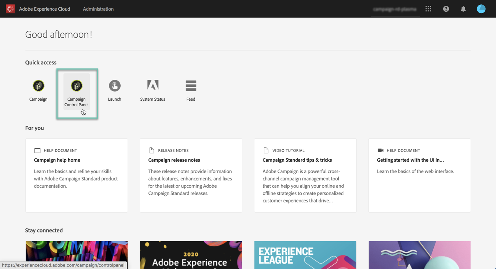

# Accessing Control Panel {#accessing-control-panel}

The Control Panel is available directly from the Experience Cloud, or from the product itself.

It is accessible to **Admin users** only. For more on how to assign users to the Administrators group, refer to [this section](../../discover/using/managing-permissions.md).

## Access from the Experience Cloud Platform {#access-experience-cloud-platform}

To access the Control Panel from the Adobe Experience Cloud Platform, follow the steps below.

1. Navigate to the [Experience Cloud homepage](https://experiencecloud.adobe.com/){target="_blank"}.

1. Click the dedicated link in the **Quick Access** section.

    

The Control Panel is also accessible from the Experience Cloud Platform **solution picker**:

1. From the [Adobe Experience Cloud homepage](https://experiencecloud.adobe.com/){target="_blank"}, select **Campaign** from the **Quick Access** section or the top menu on the right.

    

1. The list of your Campaign instances displays. Click the **Control Panel** card to launch it.

    

## Access from the product {#access-product}

>[!NOTE]
>
>Access from within the product is available for [Campaign Standard](https://experienceleague.adobe.com/docs/campaign-standard/using/campaign-standard-home.html?lang=en){target="_blank"} only.

1. Open your Campaign Standard product.

1. Select the **[!UICONTROL Administration]** menu from the **Navigation** pane.

    

1. Click the **[!UICONTROL Control Panel]** icon.

    
