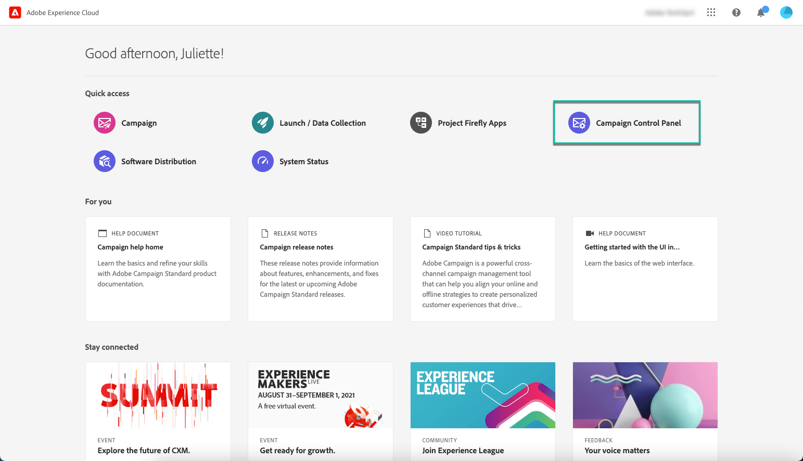
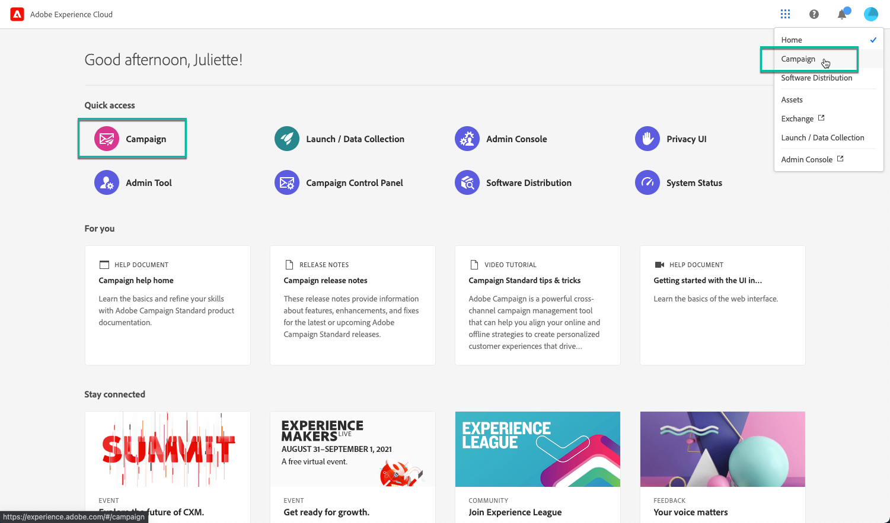
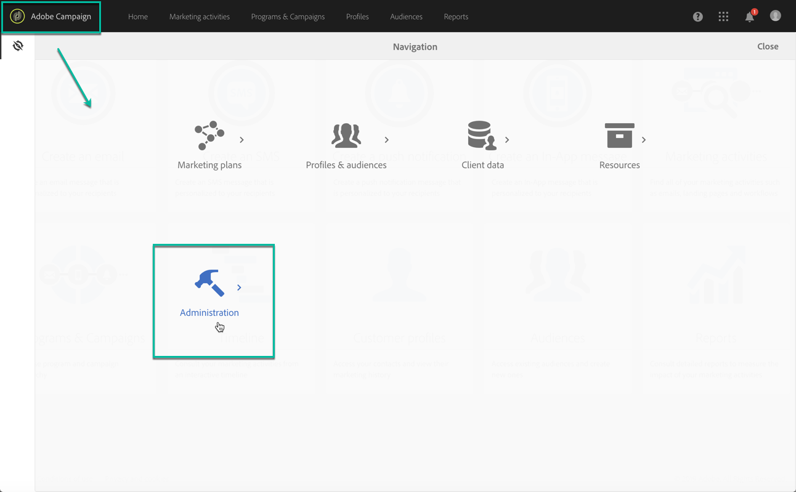

# Accessing Control Panel {#accessing-control-panel}

The Control Panel is available directly from the Experience Cloud, or from the product itself.

## Prerequisites {#prerequisites}

For Campaign v7/v8, note that your instance must be hosted on Amazon Web Services (AWS) and upgraded to the latest [Campaign stable build](https://experienceleague.adobe.com/docs/campaign-classic/using/release-notes/rn-overview.html#rn-statuses) or to build 9032 or higher. Learn how to check your version in [this section](https://experienceleague.adobe.com/docs/campaign-classic/using/getting-started/starting-with-adobe-campaign/launching-adobe-campaign.html#getting-your-campaign-version). To check if your instance is hosted on AWS, follow the steps detailed in [this page](../../faq.md#hosted-aws).

Campaign v8 instances hosted on Microsoft Azure also have access to a subset of Control Panel capabilities: [IP allow listing for instance access](../../instances-settings/using/ip-allow-listing-instance-access.md), [IP allow listing for SFTP servers](../../sftp/using/ip-range-allow-listing.md), and [customer-managed SSL certificate management](../../subdomains-certificates/using/renewing-subdomain-certificate.md).

>[!IMPORTANT]
>
>By default, the Control Panel is accessible to Admin users belonging to the "Administrators" Product Profile. According to your organization configuration, the Product Profile can be named differently ("admin", "admins", "approval admin", etc.). **Any Product Profile containing the word "admin" in its name will automatically grant access to Control Panel**. Carefully review your Product Profile naming to ensure only authorized users have Control Panel access. [Learn how to manage permissions to Control Panel](../../discover/using/managing-permissions.md).

## Access from the Experience Cloud Platform {#access-experience-cloud-platform}

To access the Control Panel from the Adobe Experience Cloud Platform, follow the steps below.

1. Navigate to the [Experience Cloud homepage](https://experiencecloud.adobe.com/){target="_blank"}.

1. Click the dedicated link in the **Quick Access** section.

    

The Control Panel is also accessible from the Experience Cloud Platform **solution picker**:

1. From the [Adobe Experience Cloud homepage](https://experiencecloud.adobe.com/){target="_blank"}, select **Campaign** from the **Quick Access** section or the top menu on the right.

    

1. The list of your Campaign instances displays. Click the **Control Panel** card to launch it.

    

## Access from the product {#access-product}

>[!NOTE]
>
>Access from within the product is available for [Campaign Standard](https://experienceleague.adobe.com/docs/campaign-standard/using/campaign-standard-home.html){target="_blank"} only.

1. Open your Campaign Standard product.

1. Select the **[!UICONTROL Administration]** menu from the **Navigation** pane.

    

1. Click the **[!UICONTROL Control Panel]** icon.

    
