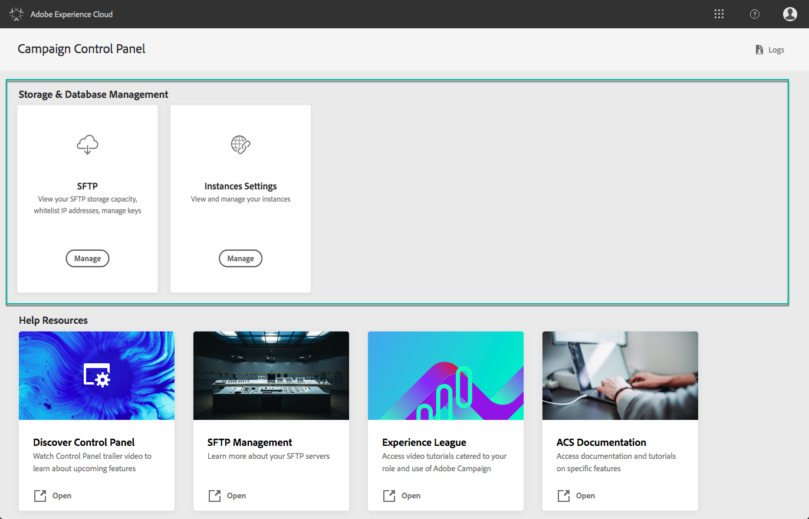
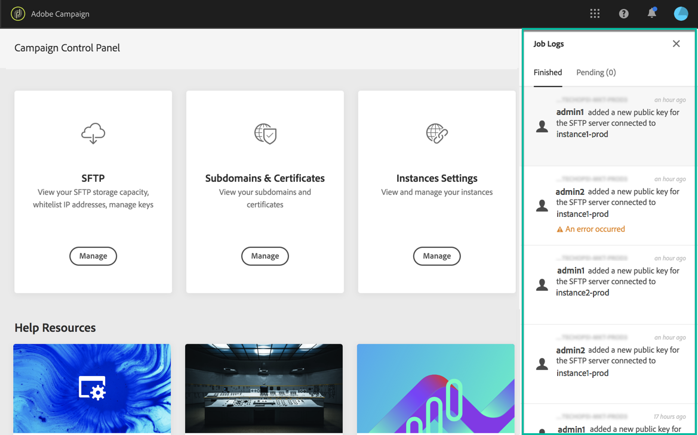

# Discovering Control Panel interface {#discovering-interface}

The Control Panel home page gives you access to all actions that can be performed on your Campaign instances.

They are represented by cards that are organized into topics, for example **Performance monitoring**.

<!--With upcoming Campaign releases, more topics and cards will be made available.-->

## Job logs {#job-logs}

The **[!UICONTROL Job Logs]** button in the upper-right corner lets you audit all the changes that have been made by users of your organization.

Click an element of the list to get more details.

The **[!UICONTROL Open]** button allows you to access directly the Control Panel tab where the change has been made.

## Help resources {#help-resources}

The **[!UICONTROL Help Resources]** section provides useful documentation to help you in your use of the Control Panel and Campaign products. Do not hesitate to explore them.

## Supported languages {#languages}

The Control Panel user interface is designed to display in the language that matches your browser's configuration.

If your browser is set to a language that is not supported, Control Panel checks the first three languages in your browser's language list until it finds a supported language. If none of the first three languages are supported by Control Panel, it will default to using English (United States).

Below is a list of languages currently supported by Control Panel:

* English (United States)
* German
* French
* Japanase
* Italian (Italy)
* Spanish (Spain)
* Korean
* Portuguese (Brazil)
* Chinese (Simplified)
* Chinese (Traditional)
