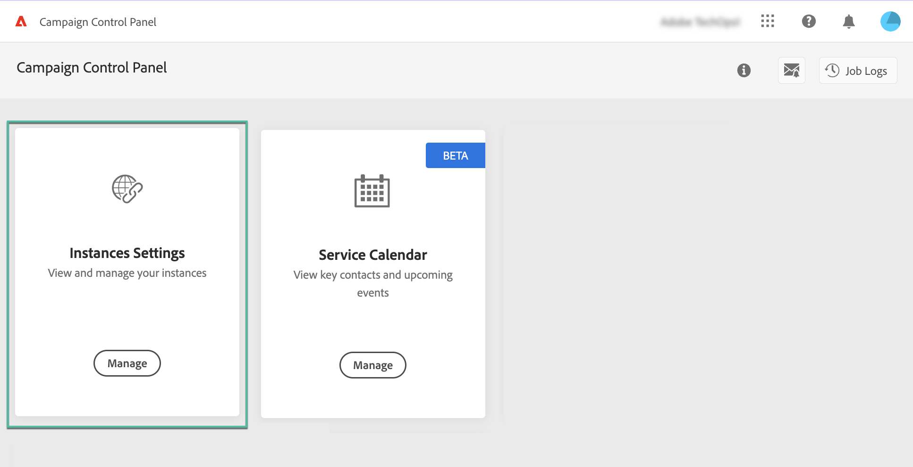
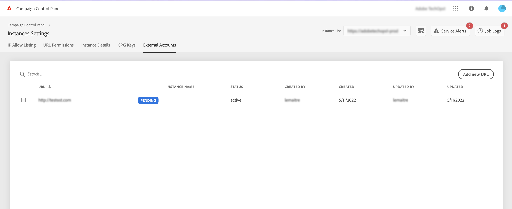
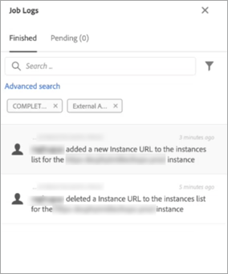

# Add MID/RT instances (hybrid model){#add-mid-rt-instances-hybrid-model}

>[!CONTEXTUALHELP]
>id="cp_externalaccounts"
>title="External Accounts"
>abstract="In this screen, customers with hybrid hosting model can provide their MID/RT instance URL configured in the marketing instance in Control Panel, in order to leverage Control Panel capabilities."

Control Panel allows customers with hybrid hosting model to leverage specific Control Panel capabilities. To do this, they need to provide the MID/RT instance URL configured in their marketing instance in Control Panel.

For more information on hosting models, refer to [Campaign Classic documentation](https://experienceleague.adobe.com/docs/campaign-classic/using/installing-campaign-classic/architecture-and-hosting-models/hosting-models-lp/hosting-models.html).

## Add a MID/RT instance {#add}

>[!CONTEXTUALHELP]
>id="cp_externalaccounts_url"
>title="URL"
>abstract="URL of the instance, which can be found in Campaign Client Console in the Administration > Platform > External Accounts menu."

>[!CONTEXTUALHELP]
>id="cp_externalaccounts_operator"
>title="Operator"
>abstract="ID of the operator provided after intial provisioning by Adobe Admin."

>[!CONTEXTUALHELP]
>id="cp_externalaccounts_password"
>title="Password"
>abstract="Password of the operator provided after intial provisioning by Adobe Admin."

Hybrid customers should connect to Control Panel through Experience Cloud. When accessing Control Panel for the first time, only two cards display on the homepage.

>[!NOTE]
>
>In case you run into any issues to access Control Panel, it is most likely that your marketing instance is not yet mapped with your [organization ID](https://experienceleague.adobe.com/docs/core-services/interface/administration/organizations.html). Please contact Customer Care to complete this setup to proceed further. On successful connection, you would see Control Panel homepage.

To be able to access Control Panel capabilities, you need to provide your MID/RT instance information in the **[!UICONTROL Instances Settings]** card. To do this, follow the steps below.

1. In the **[!UICONTROL Instances Settings]** card, select the **[!UICONTROL External Accounts]** tab.

1. Select the desired marketing instance from the drop-down list, then click **[!UICONTROL Add new URL]**.

    

1. Provide information about the MID/RT instance to add.

    

    * **[!UICONTROL URL]**: URL of the instance, which can be found in Campaign Client Console in the **[!UICONTROL Administration]** > **[!UICONTROL Platform]** > **[!UICONTROL External Accounts]** menu.

        

    * **[!UICONTROL Operator]** / **[!UICONTROL Password]**: Credentials of the operator provided after intial provisioning by Adobe Admin. 

        >[!NOTE]
        >
        >If these details are not available, contact Customer Care.

1. Click **[!UICONTROL Save]** to confirm.

On adding MID/RT URL, an async process is triggered to validate the correctness of the URLs. This process might take a few minutes. Until the MID/RT instance URL is validated, job will be pending. Only on validation complete, you can access Control Panel main capabilities.

You can remove or deactivate a MID/RT instance URL at any time by selecting it from the list.

Note that you can monitor any action performed in the **[!UICONTROL External Accounts]** tab on a MID/RT instance URL from the **[!UICONTROL Job Logs]**: 

## Capabilities available for hybrid customers {#capabilities}

Once an MID/RT instance is added to the Control Panel, you can leverage the capabilities listed below:

* [Monitor key contacts and events](../../service-events/service-events.md)
* [View your instance details](../../instances-settings/using/instance-details.md),
* [Add IP addresses to the allow list](../../instances-settings/using/ip-allow-listing-instance-access.md) (for RT instances),
* [Set up new subdomains](../../subdomains-certificates/using/setting-up-new-subdomain.md),
* [Renew subdomains' SSL certificates](../../subdomains-certificates/using/renewing-subdomain-certificate.md).
