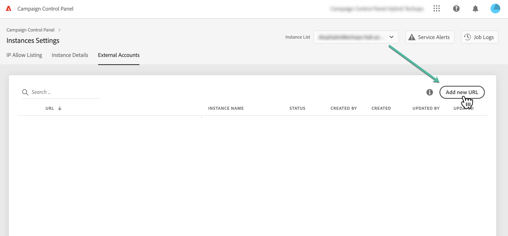
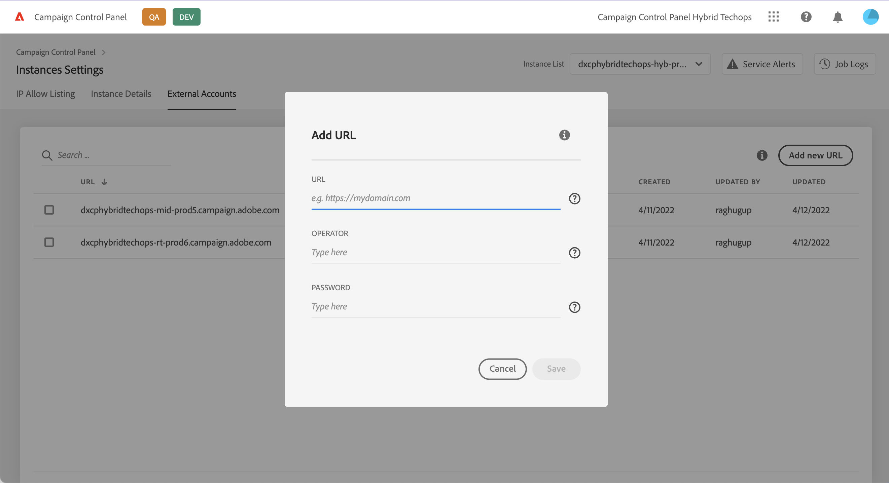
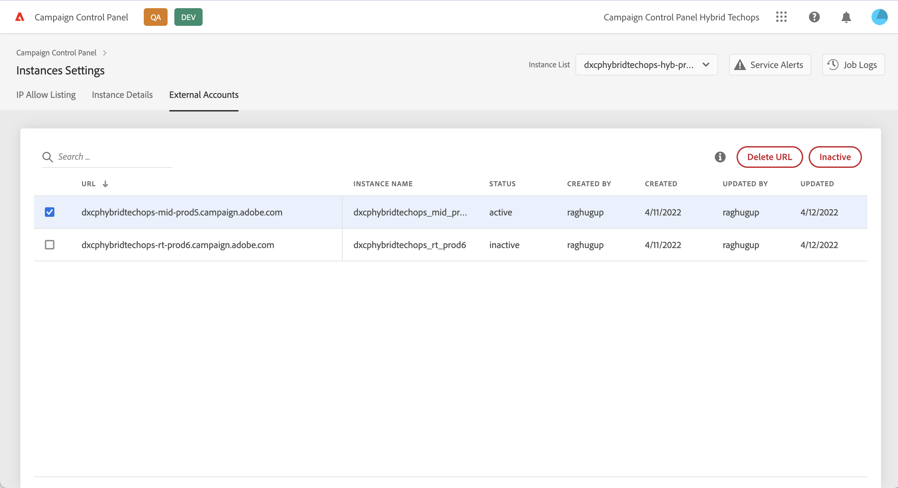

# Connect MID/RT instances

>[!CONTEXTUALHELP]
>id="cp_externalaccounts_url"
>title="Subdomain details"
>abstract="In this screen, customers with an hybrid hosting model can provide their MID/RT instances present in their marketing instance in order to perform specific actions in Control Panel."

Control Panel allows customers with an hybrid hosting model to perform specific action in Control Panel by providing their MID/RT instances present in their marketing instance. For more information on hosting models, refer to [Campaign Classic documentation](https://experienceleague.adobe.com/docs/campaign-classic/using/installing-campaign-classic/architecture-and-hosting-models/hosting-models-lp/hosting-models.html).

## Connect a MID/RT instance {#connect}

>[!CONTEXTUALHELP]
>id="cp_externalaccounts_operator"
>title="Subdomain details"
>abstract="ID of the operator used in the Client Console to add the MID/RT instance in the marketing instance."

>[!CONTEXTUALHELP]
>id="cp_externalaccounts_password"
>title="Subdomain details"
>abstract="Password of the operator used in the Client Console to add the MID/RT instance in the marketing instance."

To provide a MID/RT instance in the Control Panel, follow these steps:

1. In the **[!UICONTROL Instances Settings]** card, select the **[!UICONTROL External Accounts]** tab.

1. Select the marketing instance from the drop-down list, then click **[!UICONTROL Add new URL]**.

    

1. Provide information about the MID/RT instance to connect:
    * **[!UICONTROL URL]**: URL of the instance,
    * **[!UICONTROL Operator]** / **[!UICONTROL Password]**: Credentials of the operator used in the Client Console to add the MID/RT instance in the marketing instance.

    

1. Click **[!UICONTROL Save]** to confirm.

Your instance is now connected to the Control Panel. You can remove or deactivate a connection at any time by selecting it from the list.

## Capabilities available for MID/RT instances {#capabilities}

Once an MID/RT instance is connected to the Control Panel, you can leverage the capabilities listed below to monitor it:

* [View your instance details](../../instances-settings/using/instance-details.md),
* [Add IP addresses to the allow list to access your instances](../../instances-settings/using/ip-allow-listing-instance-access.md),
* [View information about delegated subdomains](../../subdomains-certificates/using/setting-up-new-subdomain.md),
* [View information about SSL certificates](../../subdomains-certificates/using/monitoring-ssl-certificates.md).
