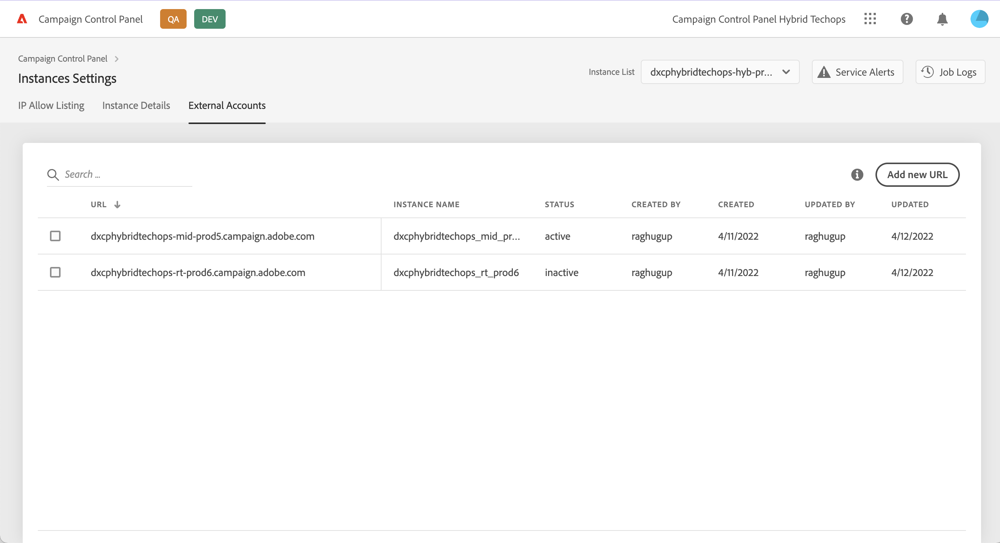

# Connect hybrid instances 

only v7?

ref: https://experienceleague.adobe.com/docs/campaign-classic/using/installing-campaign-classic/architecture-and-hosting-models/hosting-models-lp/hosting-models.html?lang=en

## Connect an hybrid instance {#connect}

1. In the **[!UICONTROL Instances Settings]** card, select the desired instance, then click the **[!UICONTROL External account]** tab.

    

1. Click **[!UICONTROL Add new URL]**, then fill in the required fields:

    * **[!UICONTROL URL]**: 
    * **[!UICONTROL Operator]**: 
    * **[!UICONTROL Password]**: 

1. Click **[!UICONTROL Save]** to confirm.

Your instance is now connected to the Control Panel. You can remove or deactivate a connection at any time by selecting it from the list.

## Capabilities available to hybrid instances {#capabilities}

Once an hybrid instance is connected to the Control Panel, you can leverage the Control Panel capabilities listed below to manage your instance:

* 
* 
* 
* 
