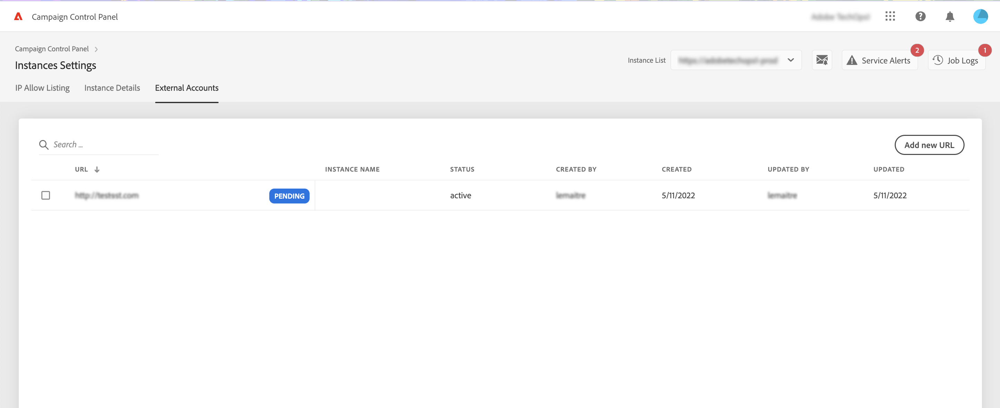

# Connect MID/RT instances (hybrid model)

>[!CONTEXTUALHELP]
>id="cp_externalaccounts_url"
>title="Subdomain details"
>abstract="In this screen, customers with hybrid hosting model can provide their MID/RT instances present in their marketing instance in order to leverage Control Panel capabilities."

Control Panel allows customers with hybrid hosting model to leverage specific Control Panel capabilities. To do this, they need to provide in Control Panel the MID/RT instance URL configured in their marketing instance.

For more information on hosting models, refer to [Campaign Classic documentation](https://experienceleague.adobe.com/docs/campaign-classic/using/installing-campaign-classic/architecture-and-hosting-models/hosting-models-lp/hosting-models.html).

## Connect a MID/RT instance {#connect}

>[!CONTEXTUALHELP]
>id="cp_externalaccounts_operator"
>title="Subdomain details"
>abstract="ID of the operator used in the Client Console to add the MID/RT instance in the marketing instance."

>[!CONTEXTUALHELP]
>id="cp_externalaccounts_password"
>title="Subdomain details"
>abstract="Password of the operator used in the Client Console to add the MID/RT instance in the marketing instance."

When accessing Control Panel for the first time, only two cards display on the homepage. To be able to access Control Panel capabilities, you need to provide your MID/RT instance information in the **[!UICONTROL Instances Settings]** card. To do this, follow the steps below.

1. In the **[!UICONTROL Instances Settings]** card, select the **[!UICONTROL External Accounts]** tab.

1. Select the desired marketing instance from the drop-down list, then click **[!UICONTROL Add new URL]**.

    

1. Provide information about the MID/RT instance to connect:
    * **[!UICONTROL URL]**: URL of the instance,
    * **[!UICONTROL Operator]** / **[!UICONTROL Password]**: Credentials of the operator provided after intial provisioning by Adobe Admin. 

        >[!NOTE]
        >
        >If these details are not available, contact Customer Care.

    

1. Click **[!UICONTROL Save]** to confirm.

On adding MID/RT URL, an async process is triggered to validate the correctness of the URLs. This process might take a few seconds. Until the MID/RT instance URL is validated, status will be pending. Only on validation complete, you can access Control Panel main capabilities.

You can remove or deactivate a MID/RT instance URL at any time by selecting it from the list.

Note that you can monitor any action performed on a MID/RT instance URL from the **[!UICONTROL Job Logs]**: 

## Capabilities available for MID/RT instances {#capabilities}

Once an MID/RT instance is connected to the Control Panel, you can leverage the capabilities listed below:

* [View your instance details](../../instances-settings/using/instance-details.md),
* [Add IP addresses to the allow list to access your instances](../../instances-settings/using/ip-allow-listing-instance-access.md) (for RT instances),
* [View information about delegated subdomains](../../subdomains-certificates/using/setting-up-new-subdomain.md),
* [View information about SSL certificates](../../subdomains-certificates/using/monitoring-ssl-certificates.md).
