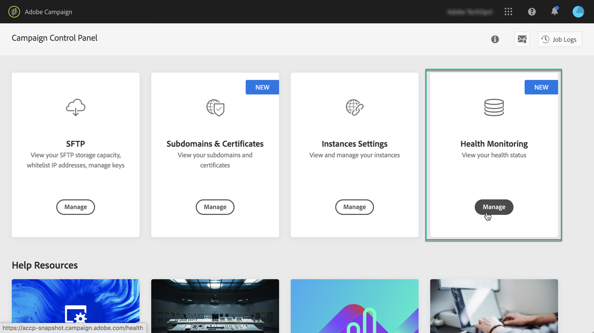

# About performance monitoring {#about-performance-monitoring}

Control Panel provides several functionalities to help you monitor your instances and ensure optimal performances.

The **[!UICONTROL Performance monitoring]** card in the Control Panel home page allows you to monitor the usage of your Campaign instances like, for example, their database capacity. For more on this, refer to [this section](../../performance-monitoring/using/database-monitoring.md).

>[!NOTE]
>
>With upcoming Control Panel releases, additional monitoring functionalities will be made available in this card.

