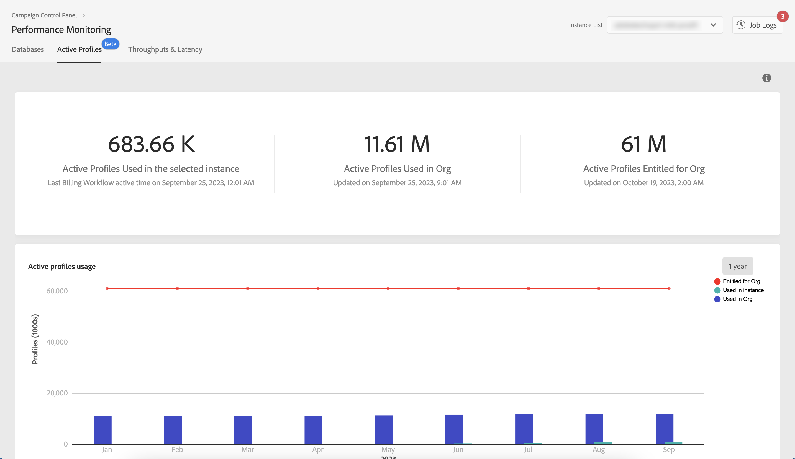

# Monitor active profiles {#active-profiles-monitoring}

## About active profiles {#about-active-profiles}

>[!IMPORTANT]
>
>Active profiles monitoring from the Control Panel is available in beta, and subject to frequent updates and modifications without notice. It is available from Campaign Standard 10368 build.

According to your contract, each of your Campaign instances is provisioned with a specific amount of active profiles that are counted for billing purposes. Please refer to your latest contract for reference on number of purchased active profiles.

“Profile” means a record of information (e.g.: a record in the nmsRecipient table or an external table containing a cookie ID, Customer ID, mobile identifier or other information relevant to a particular channel) representing an end-customer, prospect, or lead.

Profiles are considered active if they have been targeted or communicated with in the past 12 months via any channel.

>[!NOTE]
>
>Facebook and Twitter channels are not taken into account.

For more on active profiles, refer to [Campaign Standard](https://experienceleague.adobe.com/docs/campaign-standard/using/profiles-and-audiences/managing-profiles/active-profiles.html) and [Campaign v7/v8](https://experienceleague.adobe.com/docs/campaign-classic/using/getting-started/profile-management/about-profiles.html#active-profiles) documentations.

## Monitor your active profiles usage {#monitoring-active-profiles}

>[!CONTEXTUALHELP]
>id="cp_performancemonitoring_active_profile"
>title="About active profiles monitoring"
>abstract="In this tab, you can get real-time information on the latest and historical active profiles usage and evolution for each in your Campaign instances and your organization."

Information related to active profiles usage is updated in Control Panel based on dedicated [!DNL Campaign] technical workflows which run everyday on your instances:
* The ["Billing"](https://experienceleague.adobe.com/docs/campaign-standard/using/administrating/application-settings/technical-workflows.html) workflow for Campaign Standard,
* The ["Number of active billing profiles"](https://experienceleague.adobe.com/docs/campaign-classic/using/automating-with-workflows/advanced-management/about-technical-workflows.html) workflow for Campaign v7/v8.

To monitor your active profile usage in Control Panel, navigate to the **[!UICONTROL Performance Monitoring]** card > **[!UICONTROL Active Profiles]** tab, and select the desired instance from the **[!UICONTROL Instance List]**.

Information displays regarding your usage of active profiles. 

The upper section displays the following information:

* The count of active profiles currently used in the selected instance, along with the timestamp of the most recent billing workflow execution for your instance.

* The total count of active profiles used across your organization within all instances.

    >[!NOTE]
    >
    >This section is visible only if you have multiple instances associated with your organization.

* The total count of active profiles allocated to your organization.

The lower section provides a visual representation of active profile usage over the past 30 days. You can change this time frame to 1 year using the filter located in the upper-right corner. Hovering over the graph allows you to get the exact number of Active profiles used on the selected period.
