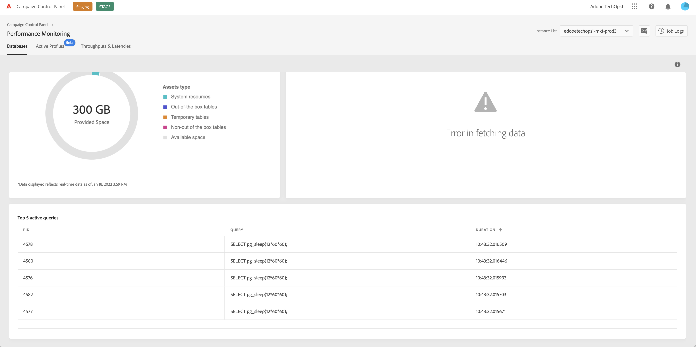

# Monitoring active queries {#long-running-queries}

The **[!UICONTROL Active queries]** area from the **[!UICONTROL Performance Monitoring]** tab lists the five queries that have been running for the longest time on the selected intance.

The **[!UICONTROL Duration]** columns specifies for how long a query has been running on the instance. Duration displays in this format: `hh:mm:ss.ms`.

>[!IMPORTANT]
>
>If one of the queries has been active for more than 24 hours, reach out to Customer Care so that they identify and resolve the issue. In that case, you will need to provide them with the **[!UICONTROL PID]** column value, which is a unique identifier for the query.
