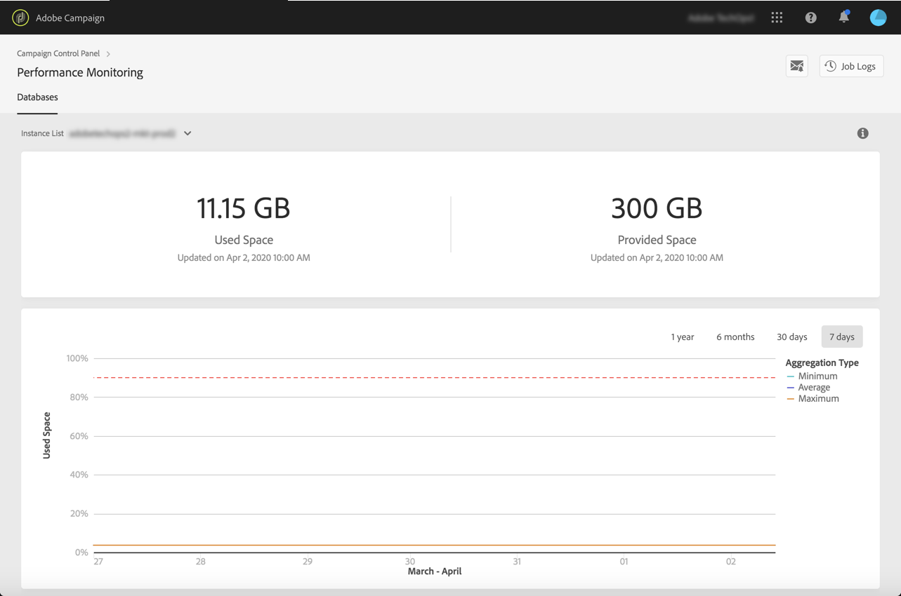
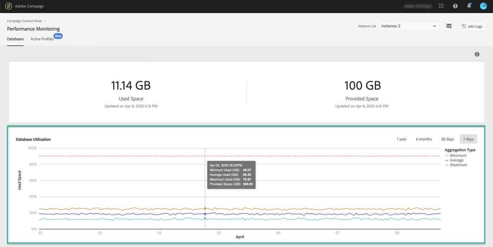
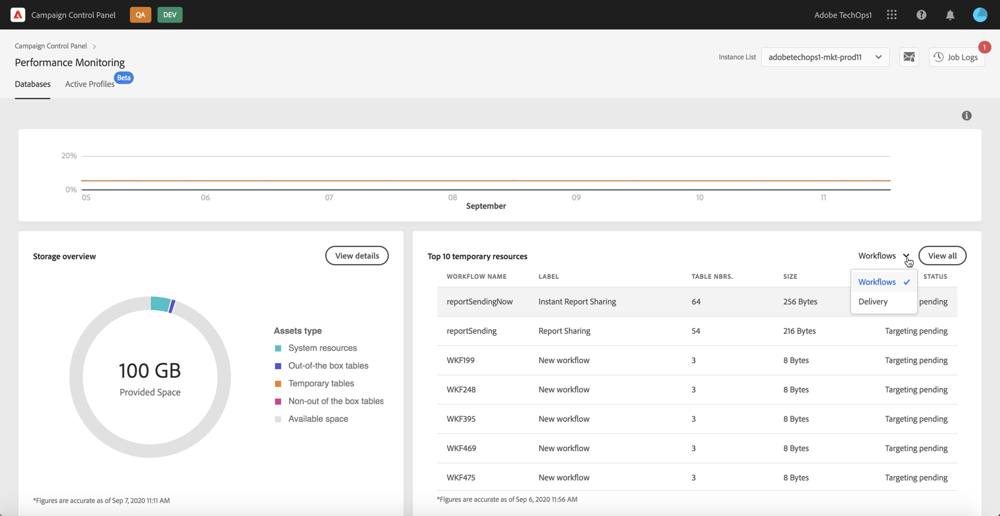

# Database monitoring {#database-monitoring}

## About instances databases {#about-instances-databases}

According to your contract, each of your Campaign instances is provisioned with a specific amount of database space.

Databases include all **assets**, **workflows** and **data** that is stored in Adobe Campaign.

Over time, databases can reach their maximum capacity, especially if the stored resources are never deleted from the instance, or if there are many workflows in a paused state.

Overflowing an instance database can lead to several issues (inability to login, to send emails etc.). Monitoring your instances' databases is therefore essential to ensure optimal performance.

>[!NOTE]
>
>The amount of database space provided as shown in the Control Panel may not reflect the amount of Database space specified in your contract. Most often, larger database space is provided to you temporarily to ensure performance of your system.

## Monitoring database usage {#monitoring-instances-database}

Control Panel allows you to monitor the database usage for each of your Campaign instances. To do this, follow the steps below.

1. Open the **[!UICONTROL Performance Monitoring]** card, then select the **[!UICONTROL Databases]** tab.

1. Select the desired instance from the **[!UICONTROL Instance List]**.

1. Information displays about the instance's database capacity and used space.

    

Additional metrics are available to help you analyze the usage of the instance's database.

Data is updated each time the **[!UICONTROL Database cleanup technnical workflow]** is run on your Campaign instance (see [Campaign Standard](https://docs.adobe.com/help/en/campaign-standard/using/administrating/application-settings/technical-workflows.html#list-of-technical-workflows) and [Campaign Classic](https://docs.adobe.com/help/en/campaign-classic/using/monitoring-campaign-classic/data-processing/database-cleanup-workflow.html) documentation).

You can check the last time the workflow ran below the graph. If the workflow has not been running since more than 3 days, we recommend you reach out Adobe Customer care, so that they investigate it is not running.

### Database utilization

The **[!UICONTROL Database utilization]** area provides a graphical representation of the minimum, average and maximum database utilization over the last 7 days, as well as the 90% database utilization threshold, represented by a red dotted curve.

To change the period of time, use the filters available in the upper-right corner of the graph.

For better readability, you can also highlight one or several curves in the graph. To do this, select them from the  **[!UICONTROL Aggregation Type]** legend.

For more details on a specific period of time, hover over the graph to display information on the database usage that was made at this time.

>[!NOTE]
>
>Additionally to this dashboard, you can receive notifications when one of your databases is reaching its capacity. To do this, subscribe to [email alerts](../../performance-monitoring/using/email-alerting.md)

### Storage overview

The **[!UICONTROL Storage overview]** area provides a graphical representation of the space occupied by:

* System resources,
* Out-of-the-box tables: provided by default with your Campaign instances),
* Temporary tables: tables created by workflows, deliveries,
* Non-out of the box tables: custom tables).

The **[!UICONTROL View details]** button allows you to access information on the different tables that are using space on your database.

The filter allows you to display tables from a specific asset type only. Detailed information, depending on the asset, is then available. You can, for example, display temporary tables generated by workflows.

### Top 10 temporary resources

The **[!UICONTROL Top 10 temporary resources]** area lists the 10 largest temporary resources generated by workflows and deliveries.

Monitoring workflows and deliveries that are creating large temporary resources is a key step to monitor your database. If any temporary resource is occupying too much space, make sure that having rhis workflow or delivery is necessary and eventually go to your instance and stop it.

General recommendation is to avoid having more than 40 columns in temporary resources that are not out-of-the-box.

The **[!UICONTROL View all]** button alows you to access detailed information on these temporary resources.  

>[!NOTE]
>
>**[!UICONTROL Keep interim results]** is an option available in workflows' properties that allows you  to save the results of the transitions between the workflows' activities.
This columns provides information on the number of results contained in the workflow's transitions.

## Preventing database overload {#preventing-database-overload}

Campaign Standard and Classic offer various ways of preventing overconsumption of database disk space.

The section below provides useful resources from Campaign documentations to help you optimize your databases usage:

**Workflows monitoring**

* [Workflows best practices](https://docs.adobe.com/content/help/en/campaign-standard/using/managing-processes-and-data/workflow-general-operation/best-practices-workflows.html) (Campaign Standard)
* [Monitoring workflow execution](https://docs.adobe.com/help/en/campaign-classic/using/automating-with-workflows/monitoring-workflows/monitoring-workflow-execution.html) (Campaign Classic)

**Database maintenance**

* Database cleanup technnical workflow ([Campaign Standard](https://docs.adobe.com/help/en/campaign-standard/using/administrating/application-settings/technical-workflows.html#list-of-technical-workflows) / [Campaign Classic](https://docs.adobe.com/help/en/campaign-classic/using/monitoring-campaign-classic/data-processing/database-cleanup-workflow.html))
* [Database maintenance guide](https://docs.adobe.com/content/help/en/campaign-classic/using/monitoring-campaign-classic/database-maintenance/recommendations.html) (Campaign Classic)
* [Database performance troubleshooting](https://docs.adobe.com/content/help/en/campaign-classic/using/monitoring-campaign-classic/troubleshooting/database-performances.html) (Campaign Classic)
* [Database-related options](https://docs.adobe.com/help/en/campaign-classic/using/installing-campaign-classic/appendices/configuring-campaign-options.html#database) (Campaign Classic)
