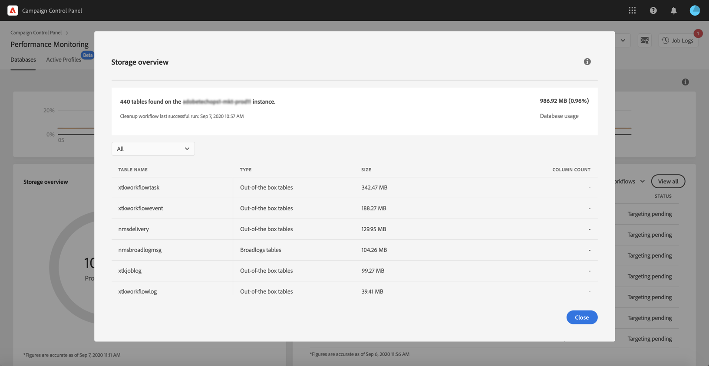

# Database monitoring {#database-monitoring}

## About instances databases {#about-instances-databases}

According to your contract, each of your Campaign instances is provisioned with a specific amount of database space.

Databases include all **assets**, **workflows** and **data** that is stored in Adobe Campaign.

Over time, databases can reach their maximum capacity, especially if the stored resources are never deleted from the instance, or if there are many workflows in a paused state.

Overflowing an instance database can lead to several issues (inability to login, to send emails etc.). Monitoring your instances' databases is therefore essential to ensure optimal performance.

>[!NOTE]
>
>If the amount of provided database space provided as shown in the Control Panel does not reflect the amount specified in your contract, reach out to Customer Care.

## Monitoring database usage {#monitoring-instances-database}

 Discover this feature in video using [Campaign Classic](https://experienceleague.adobe.com/docs/campaign-classic-learn/control-panel/performance-monitoring/monitoring-databases.html?lang=en#performance-monitoring) or [Campaign Standard](https://experienceleague.adobe.com/docs/campaign-standard-learn/control-panel/performance-monitoring/monitoring-databases.html?lang=en#performance-monitoring)

Control Panel allows you to monitor the database usage for each of your Campaign instances. To do this, open the **[!UICONTROL Performance Monitoring]** card, then select the **[!UICONTROL Databases]** tab.

Select the desired instance from the **[!UICONTROL Instance List]** to display information about the instance's database capacity and used space.

>[!NOTE]
>
>Note that data from this dashboard is updated based on the **[!UICONTROL Database cleanup technical workflow]** that runs on your Campaign instance (see [Campaign Standard](https://docs.adobe.com/help/en/campaign-standard/using/administrating/application-settings/technical-workflows.html#list-of-technical-workflows) and [Campaign Classic](https://docs.adobe.com/help/en/campaign-classic/using/monitoring-campaign-classic/data-processing/database-cleanup-workflow.html) documentation).
>
>You can check the last time the workflow ran below the **[!UICONTROL Used Space]** and **[!UICONTROL Provided Space]** metrics. Note that, if the workflow has not been running since more than 3 days, we recommend reaching out to Adobe Customer care so that they investigate why the workflow is not running.

Additional metrics, described below, are available in this dashboard to help you analyse the usage of the instance's database:

* [Database Utilization](../../performance-monitoring/using/database-monitoring.md#database-utilization)
* [Storage overview](../../performance-monitoring/using/database-monitoring.md#storage-overview)
* [Top 10 temporary resources](../../performance-monitoring/using/database-monitoring.md#top-10)

### Database utilization {#database-utilization}

The **[!UICONTROL Database utilization]** area provides a graphical representation of the minimum, average and maximum database utilization over the last 7 days as well as the 90% database utilization threshold represented by a red dotted curve.

To change the period of time, use the filters available in the upper-right corner of the graph.

For better readability, you can also highlight one or several curves in the graph. To do this, select them from the  **[!UICONTROL Aggregation Type]** legend.

For more details on a specific period of time, hover over the graph to display information on the database usage that was made at this time.

### Storage overview {#storage-overview}

The **[!UICONTROL Storage overview]** area provides a graphical representation of the space occupied by:

* **[!UICONTROL System resources]**

    Note that, if system resources are consuming a large part of the database space, we recommend reaching out to Customer Care.

* **[!UICONTROL Out-of-the-box tables]** provided by default with your Campaign instances,
* **[!UICONTROL Temporary tables]** created by workflows and deliveries,
* **[!UICONTROL Non-out of the box tables]** generated after creating custom resources.

Click the **[!UICONTROL View details]** button to get more details on the different assets that are consuming database space.

Use the filter to refine your search and display tables from a specific asset type only. 

### Top 10 temporary resources {#top-10}

The **[!UICONTROL Top 10 temporary resources]** area lists the 10 largest temporary resources generated by workflows and deliveries.

Monitoring workflows and deliveries that are creating large temporary resources is a key step to monitor your database. If any temporary resource is consuming too much database space, make sure that having this workflow or delivery is necessary, and eventually navigate to your instance to stop it.

>[!IMPORTANT]
>
>General recommendation is to avoid having **more than 40 columns** in non out of the box resources.

>[!NOTE]
>
>If a workflow is found to have a large number of table counts or database size, we recommend reviewing the workflow in order to investigate why it is generating so much data.
>
>Campaign Standard and Classic resources are also available at the end of this page to help you prevent database overload.

The **[!UICONTROL View all]** button allows you to access detailed information on these temporary resources.  

>[!NOTE]
>
>The value in the **[!UICONTROL Keep interim results]** column indicates if the option is enabled ("1") or diabled ("0") in Campaign. The **[!UICONTROL Keep interim results]** option is accessible in workflows' properties. It allows you to save the results of the transitions between the various activities of a workflow (see [Campaign Standard](https://docs.adobe.com/content/help/en/campaign-standard/using/managing-processes-and-data/executing-a-workflow/managing-execution-options.html) and [Campaign Classic](https://docs.adobe.com/content/help/en/campaign-classic/using/automating-with-workflows/general-operation/workflow-best-practices.html#logs) documentation).
>
>If the option is enabled for one of your workflows, the database cleanup workflow will not be able to reclaim the space consumed by interim results. We therefore recommend reviewing the workflow to check if the option can be turned off.

## Preventing database overload {#preventing-database-overload}

Campaign Standard and Classic offer various ways of preventing overconsumption of database disk space.

The section below provides useful resources from Campaign documentations to help you optimize your databases usage:

**Workflows monitoring**

* [Workflows best practices](https://docs.adobe.com/content/help/en/campaign-standard/using/managing-processes-and-data/workflow-general-operation/best-practices-workflows.html) (Campaign Standard)
* [Monitoring workflow execution](https://docs.adobe.com/help/en/campaign-classic/using/automating-with-workflows/monitoring-workflows/monitoring-workflow-execution.html) (Campaign Classic)

**Database maintenance**

* Database cleanup technical workflow ([Campaign Standard](https://docs.adobe.com/help/en/campaign-standard/using/administrating/application-settings/technical-workflows.html#list-of-technical-workflows) / [Campaign Classic](https://docs.adobe.com/help/en/campaign-classic/using/monitoring-campaign-classic/data-processing/database-cleanup-workflow.html))
* [Database maintenance guide](https://docs.adobe.com/content/help/en/campaign-classic/using/monitoring-campaign-classic/database-maintenance/recommendations.html) (Campaign Classic)
* [Database performance troubleshooting](https://docs.adobe.com/content/help/en/campaign-classic/using/monitoring-campaign-classic/troubleshooting/database-performances.html) (Campaign Classic)
* [Database-related options](https://docs.adobe.com/help/en/campaign-classic/using/installing-campaign-classic/appendices/configuring-campaign-options.html#database) (Campaign Classic)
* Data retention ([Campaign Standard](https://docs.adobe.com/help/en/campaign-standard/using/administrating/application-settings/data-retention.html) / [Campaign Classic](https://docs.adobe.com/help/en/campaign-classic/using/configuring-campaign-classic/data-model/data-model-best-practices.html#data-retention))

>[!NOTE]
>
>Additionally, you can receive notifications when one of your databases is reaching its capacity. To do this, subscribe to [email alerts](../../performance-monitoring/using/email-alerting.md).
