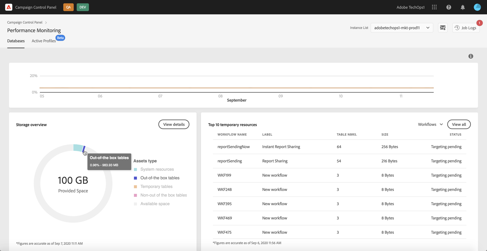
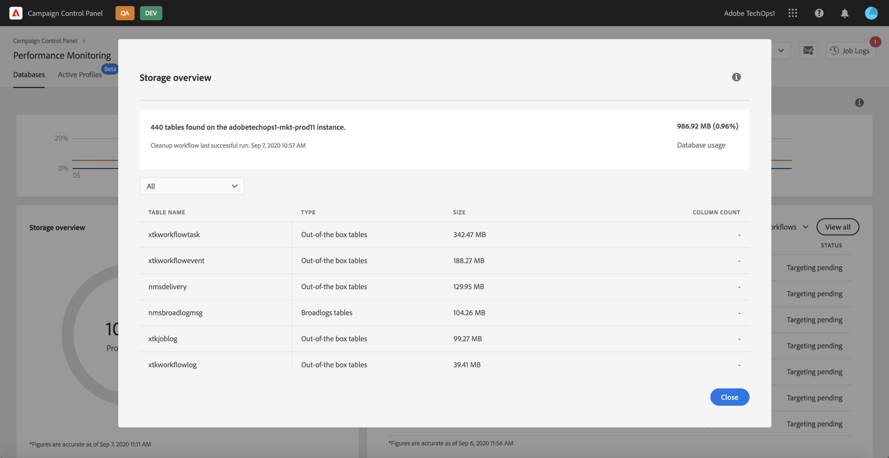

# Storage overview {#storage-overview}

>[!CONTEXTUALHELP]
>id="cp_dbdetails_storagedetails"
>title="About Storage overview"
>abstract="In this tab, you can get detailed information on the different Campaign resources that are consuming database space."

The **[!UICONTROL Storage overview]** area provides a graphical representation of the space occupied by:

* **[!UICONTROL System resources]**

    Note that, if system resources are consuming a large part of the database space, we recommend reaching out to Customer Care.

* **[!UICONTROL Out-of-the-box tables]** provided by default with your Campaign instances,
* **[!UICONTROL Temporary tables]** created by workflows and deliveries,
* **[!UICONTROL Non-out of the box tables]** generated after creating custom resources.

Click the **[!UICONTROL View details]** button to get more details on the different assets that are consuming database space.

You can use the drop-down list to refine your search and display tables from a specific asset type only (worklows, deliveries, recipients).  

Note that this screen also allows you to monitor workflow parameters that may require specific attention to avoid any issues on your instances. Learn more in [this page](workflow-monitoring.md).
