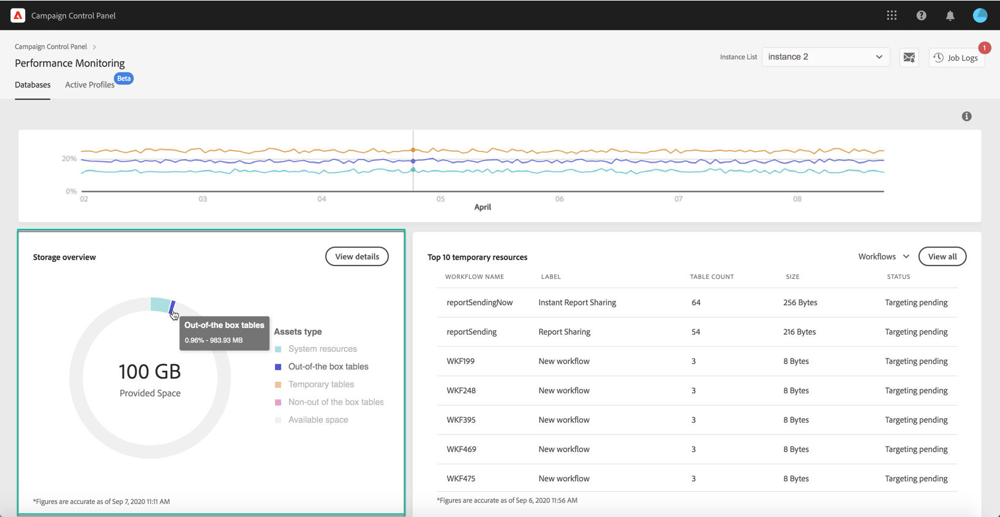

# Storage overview {#storage-overview}

>[!CONTEXTUALHELP]
>id="cp_dbdetails_storagedetails"
>title="About Storage overview"
>abstract="In this tab, you can get detailed information on the different Campaign resources that are consuming database space."

The **[!UICONTROL Storage overview]** area provides a graphical representation of the space occupied by:

* **[!UICONTROL System resources]**

    Note that, if system resources are consuming a large part of the database space, we recommend reaching out to Customer Care.

* **[!UICONTROL Out-of-the-box tables]** provided by default with your Campaign instances,
* **[!UICONTROL Temporary tables]** created by workflows and deliveries,
* **[!UICONTROL Non-out of the box tables]** generated after creating custom resources.

Click the **[!UICONTROL View details]** button to get more details on the different assets that are consuming database space.

Use the filter to refine your search and display tables from a specific asset type only. 

For workflows, an additional column (**[!UICONTROL Keep interim results]**) indicates if the option is enabled ("1") or diabled ("0") in Campaign. This option allows you to save the results of the transitions between the various activities of a workflow (see [Campaign Standard](https://experienceleague.adobe.com/docs/campaign-standard/using/managing-processes-and-data/executing-a-workflow/managing-execution-options.html) and [Campaign Classic](https://experienceleague.adobe.com/docs/campaign-classic/using/automating-with-workflows/introduction/workflow-best-practices.html#logs) documentation).

>[!IMPORTANT]
>
>This option must never be checked in a production workflow. It is used to analyze the results and is designed only for testing purposes and hence must be used only on development or staging environments.
>
>If the value in Control Panel indicates that the option is enabled for one of your workflows, we strongly recommend turning it off in Campaign.

Note that Control Panel allows you to monitor workflows and clean the generated temporary resources generated directly from this screen. Learn more in the [Monitor workflows' resources](workflow-monitoring.md) page.