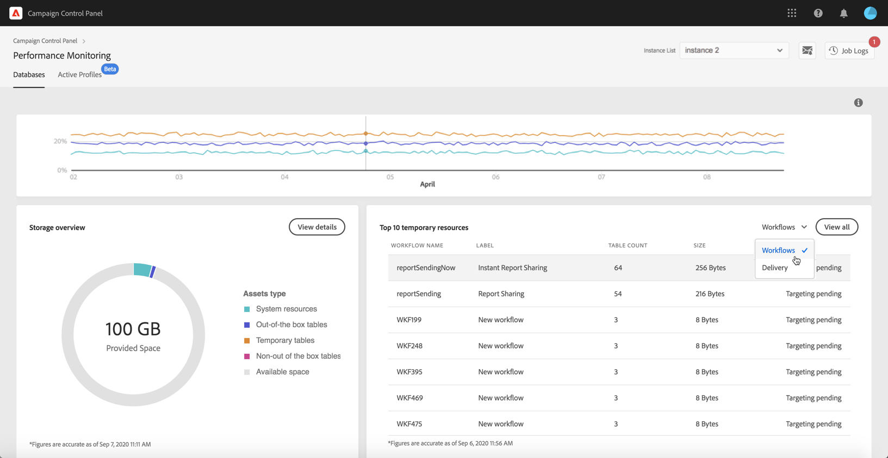

# Top 10 temporary resources {#top-10}

The **[!UICONTROL Top 10 temporary resources]** area lists the 10 largest temporary resources generated by workflows and deliveries.

Monitoring workflows and deliveries that are creating large temporary resources is a key step to monitor your database. If any temporary resource is consuming too much database space, make sure that having this workflow or delivery is necessary, and eventually navigate to your instance to stop it.

>[!IMPORTANT]
>
>General recommendation is to avoid having **more than 40 columns** in non out of the box resources.

>[!NOTE]
>
>If a workflow is found to have a large number of table counts or database size, we recommend reviewing the workflow in order to investigate why it is generating so much data.
>
>Campaign Standard and Classic resources are also available at the end of this page to help you prevent database overload.

The **[!UICONTROL View all]** button allows you to access detailed information on these temporary resources.  

The value in the **[!UICONTROL Keep interim results]** column indicates if the option is enabled ("1") or diabled ("0") in Campaign. This option allows you to save the results of the transitions between the various activities of a workflow (see [Campaign Standard](https://experienceleague.adobe.com/docs/campaign-standard/using/managing-processes-and-data/executing-a-workflow/managing-execution-options.html) and [Campaign Classic](https://experienceleague.adobe.com/docs/campaign-classic/using/automating-with-workflows/introduction/workflow-best-practices.html#logs) documentation).

>[!IMPORTANT]
>
>This option must never be checked in a production workflow. It is used to analyze the results and is designed only for testing purposes and hence must be used only on development or staging environments.
>
>If the value in Control Panel indicates that the option is enabled for one of your workflows, we strongly recommend turning it off in Campaign.
