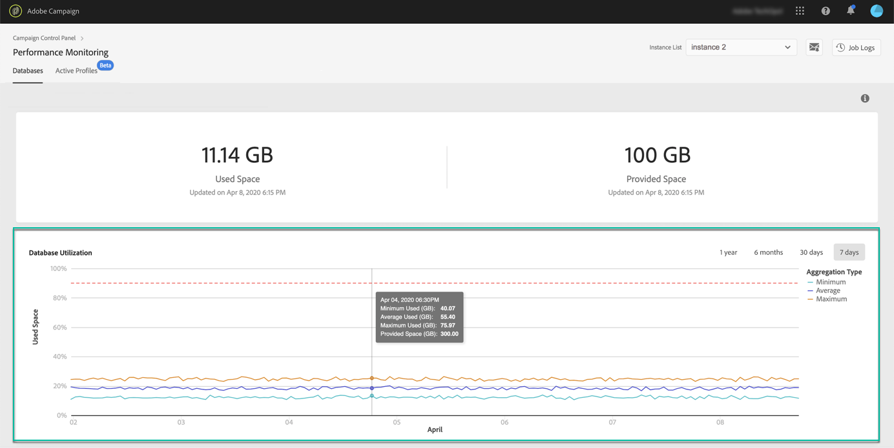

# Database utilization {#database-utilization}

The **[!UICONTROL Database utilization]** area provides a graphical representation of the minimum, average and maximum database utilization over the last 7 days as well as the 90% database utilization threshold represented by a red dotted curve.

To change the period of time, use the filters available in the upper-right corner of the graph.

For better readability, you can also highlight one or several curves in the graph. To do this, select them from the  **[!UICONTROL Aggregation Type]** legend.

For more details on a specific period of time, hover over the graph to display information on the database usage that was made at this time.

