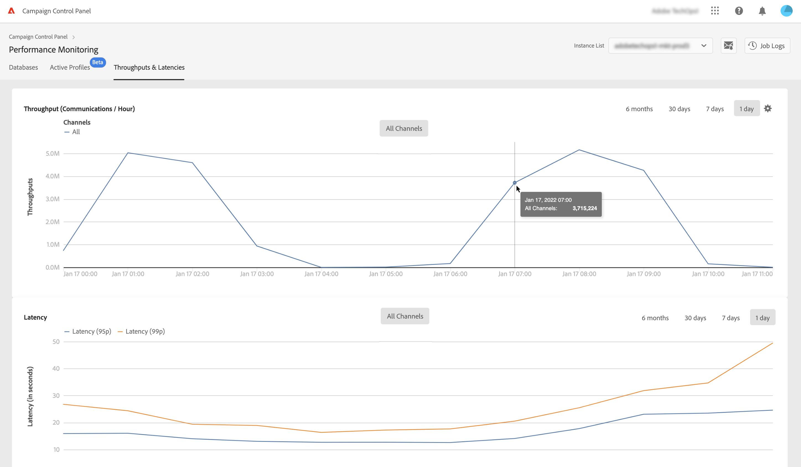
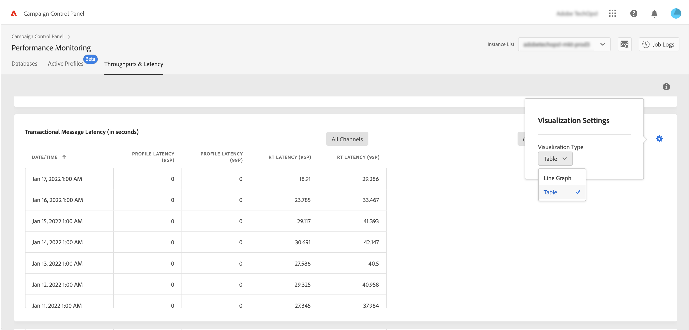

# Throughtputs and latency monitoring {#throughputs-latency-monitoring}

>[!CONTEXTUALHELP]
>id="cp_performancemonitoring_throughputslatencies"
>title="About throughputs and latency monitoring "
>abstract="In this tab, you can monitor how delivery throughputs and latency are trending over a period of time on your instances."

Monitoring how delivery throughputs and latency are trending over a period of time is essential to understand the usage of your instances and ensure they are performing well.

This information is made available in Control Panel for each of your Campaign instances in the **[!UICONTROL Performance Monitoring]** card, **[!UICONTROL Throughputs & Latency]** tab (note that the Control Panel may take up to 1 hour to display the figures).

* The **[!UICONTROL Throughput]** area provides information regarding the number of messages sent per hour from the selected Campaign instance for all the communication channels that you are entitled to.

* The **[!UICONTROL Latency]** area provides information regarding the latency encountered on the selected instance when sending real-time transactional communications. Latencies are captured and visualized at 95 and 99 percentile, meaning that 95% and 99% of the requests should be faster than the given latency.

>[!NOTE]
>
>All figures presented in this area are approximate and for information purposes only.

By default, data is displayed for the current day. You can change the displayed period of time using the **[!UICONTROL 6 months]**, **[!UICONTROL 30 days]** and **[!UICONTROL 7 days]** buttons.

You can also visualize information in a tabular format with sortable columns rather than a graph. To do this, click the **[!UICONTROL Visualization settings]** button then select **[!UICONTROL Table]**.

