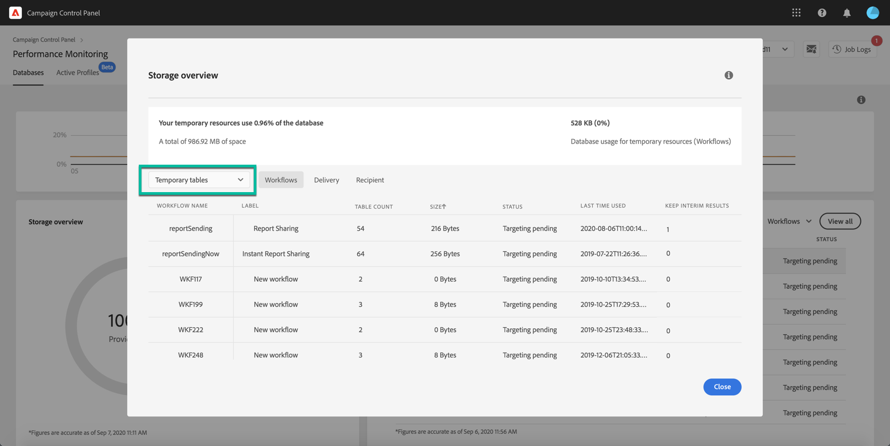

# Monitor workflows' resources {#monitor-workflows}

## Clean paused and completed workflows

When [!DNL Adobe Campaign] workflows are paused or completed, they leave temporary tables on your instances database that consume space and can lead to performance issues.

Control Panel allows you to identify those workflows and clean the temporary resources generated on your instances.

>[!NOTE]
>
>Technically, this operation executes the **[!UICONTROL Database cleanup technical workflow]** that runs on your Campaign instance everyday (see [Campaign Standard](https://experienceleague.adobe.com/docs/campaign-standard/using/administrating/application-settings/technical-workflows.html#list-of-technical-workflows) and [Campaign Classic](https://experienceleague.adobe.com/docs/campaign-classic/using/monitoring-campaign-classic/data-processing/database-cleanup-workflow.html) documentation). 

To clean paused and completed workflows, follow these steps:

1. Navigate to the **[!UICONTROL Performance monitoring]** card.

1. In the **[!UICONTROL Databases]** tab, select the instance where you want to perform the operation.

1. Access the **[!UICONTROL Storage overview]** details, then filter the list on **[!UICONTROL Temporary tables]**. Learn more on **[!UICONTROL Storage overview]** in [this page](database-storage-overview.md).

    

1. All temporary tables generated on your instances by workflows and deliveries display. Click the **[!UICONTROL Clean now]** button to delete the resources generated by paused and completed workflows.

    

1. Once the operation is confirmed, you can track the estimated remaining time in the **[!UICONTROL Storage overview]** list.

    

<!--## Monitor workflows' parameters 

some options on workflows consume space and lead to performance issues

deactivated by default. CP allows to monitor if some have been activated + to deactivate them

* Keep Result-The option "Keep interim results" of the workflow is checked. This should not be used on production as it could increase drastically database usage.
* Show SQL- The option "Log SQL result" is checked. This could impact platform performances and fill in the log files on the server, which should not be on production.
* Production no supervisor-Workflows with a "Production" flag, but no supervisor operator in the setup to be alerted if the workflow crash.
* A notification/alert, when the temp tables occupy more than 25% of the total allotted DB size. (Example - 500GB of the 2TB).

)-->
