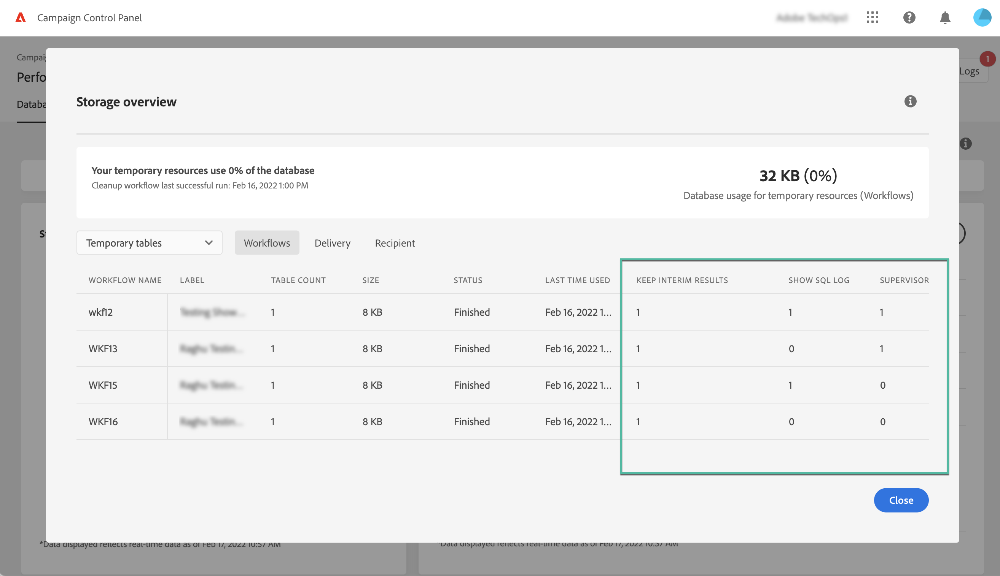

# Monitor workflows {#monitor-workflows}

<!-- Clean paused and completed workflows

When [!DNL Adobe Campaign] workflows are paused or completed, they leave temporary tables on your instances database that consume space and can lead to performance issues.

Control Panel allows you to identify those workflows and clean the temporary resources generated on your instances.

>[!NOTE]
>
>Technically, this operation executes the **[!UICONTROL Database cleanup technical workflow]** that runs on your Campaign instance everyday (see [Campaign Standard](https://experienceleague.adobe.com/docs/campaign-standard/using/administrating/application-settings/technical-workflows.html#list-of-technical-workflows) and [Campaign Classic](https://experienceleague.adobe.com/docs/campaign-classic/using/monitoring-campaign-classic/data-processing/database-cleanup-workflow.html) documentation). 

To clean paused and completed workflows, follow these steps:

1. Navigate to the **[!UICONTROL Performance monitoring]** card.

1. In the **[!UICONTROL Databases]** tab, select the instance where you want to perform the operation.

1. Access the **[!UICONTROL Storage overview]** details, then filter the list on **[!UICONTROL Temporary tables]**. Learn more on **[!UICONTROL Storage overview]** in [this page](database-storage-overview.md).

    

1. All temporary tables generated on your instances by workflows and deliveries display. Click the **[!UICONTROL Clean now]** button to delete the resources generated by paused and completed workflows.

    

1. Once the operation is confirmed, you can track the estimated remaining time in the **[!UICONTROL Storage overview]** list.

    

Monitor workflow parameters -->

In Adobe Campaign, some worklow parameters may require specific attention to avoid any issues on your instances. The Control Panel **[!UICONTROL Storage overview]** details allow you to check if any of these options are enabled for your workflows.

## **[!UICONTROL Keep interim results]** {#keep-results}

When enabled (value "1"), this option saves the results of the transitions between the various activities of a workflow. Learn more in [Campaign Standard](https://experienceleague.adobe.com/docs/campaign-standard/using/managing-processes-and-data/executing-a-workflow/managing-execution-options.html) and [Campaign Classic](https://experienceleague.adobe.com/docs/campaign-classic/using/automating-with-workflows/introduction/workflow-best-practices.html#logs) documentation.

>[!IMPORTANT]
>
>This option must never be checked in a production workflow. It is used for analysis and testing purposes, and must therefore only be used on development or staging environments. We strongly recommend turning it off in Campaign.

## **[!UICONTROL Show SQL log]** {#sql}

When this option is enabled, the SQL queries sent to the database during workflow execution are displayed in Adobe Campaign. Learn more in [Campaign Standard](https://experienceleague.adobe.com/docs/campaign-standard/using/managing-processes-and-data/executing-a-workflow/managing-execution-options.html?lang=en) and [Campaign Classic](https://experienceleague.adobe.com/docs/campaign-classic/using/automating-with-workflows/advanced-management/workflow-properties.html?lang=en#execution) documentation.

The value "1" indicates that the worklow has the **Severity** field set to "Production", and that the SQL query log option is enabled. 

>[!IMPORTANT]
>
>Activating this option may impact performances and fill in the log files on the server. It should be used for analysis and diagnostic purposes only.

## **[!UICONTROL Supervisors]** {#supervisors}

This field allows you to assign an operator to a workflow. If the workflow fails, the associated operator will be alerted. Learn more in [Campaign Standard](https://experienceleague.adobe.com/docs/campaign-standard/using/managing-processes-and-data/executing-a-workflow/monitoring-workflow-execution.html?lang=en#error-management) and [Campaign Classic](https://experienceleague.adobe.com/docs/campaign-classic/using/automating-with-workflows/advanced-management/workflow-properties.html?lang=en#error-management) documentation.

The value "1" indicates that the worklow has the **Severity** field set to "Production" and that no supervisor group has been assigned to the workflow.

