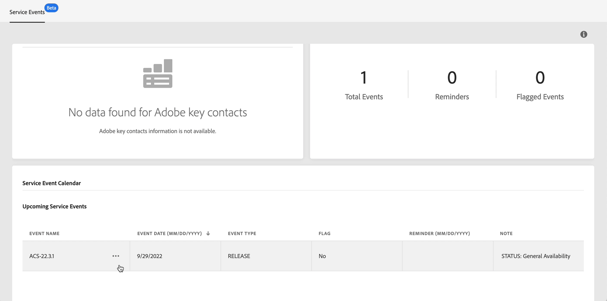
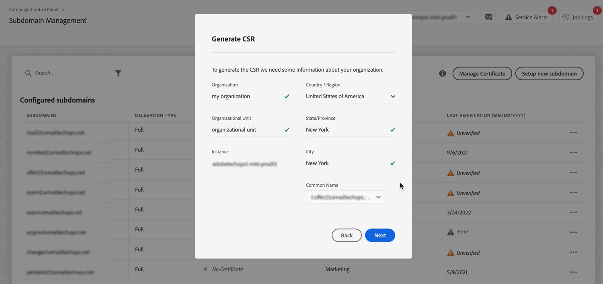

# Latest Release {#control-panel-releases}

This page lists the new features and improvements for Control Panel.

## June 2022 {#june-2022}

### What's new?

<table>
<thead>
<tr>
<th><strong>Top 10 files consuming space on SFTP servers</strong> </th>
</tr>
</thead>
<tbody>
<tr>
<td>

You can now identify the top 10 files that are consuming the most space on an SFTP server. <a href="../sftp/using/sftp-storage-management.md">Learn more</a>

</td>
</tr>
</tbody>
</table>

<table>
<thead>
<tr>
<th><strong>Service Calendar reminders</strong> </th>
</tr>
</thead>
<tbody>
<tr>
<td>

Service Calendar now allows you to set reminders in order to be notified by email before an event is going to occur on your instances. <a href="../service-events/service-events.md">Learn more</a>

</td>
</tr>
</tbody>
</table>

<table>
<thead>
<tr>
<th><strong>Subdomains' CSR generation enhancements</strong> </th>
</tr>
</thead>
<tbody>
<tr>
<td>

Several enhancements have been made to the CSR generation process. <a href="../subdomains-certificates/using/renewing-subdomain-certificate.md">Learn more</a>
<ul><li>When generating a CSR, you can now select one of the included subdomains as the Common Name.</li><li>You can now copy the CSR summary before generating the CSR.</li><li>Once a CSR has been generated, you can download it again from the job logs. This capability does not apply to certificates generated before this release.</li></ul>

</td>
</tr>
</tbody>
</table>

### Improvements

**Instances settings**

* The maximum number of GPG keys in Control Panel has been increased to 60 keys. [Learn more](../instances-settings/using/gpg-keys-management.md)

