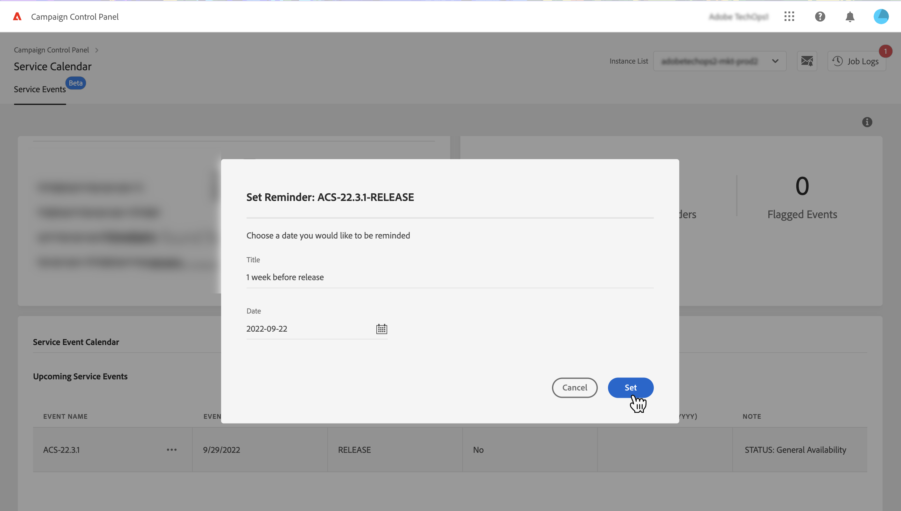
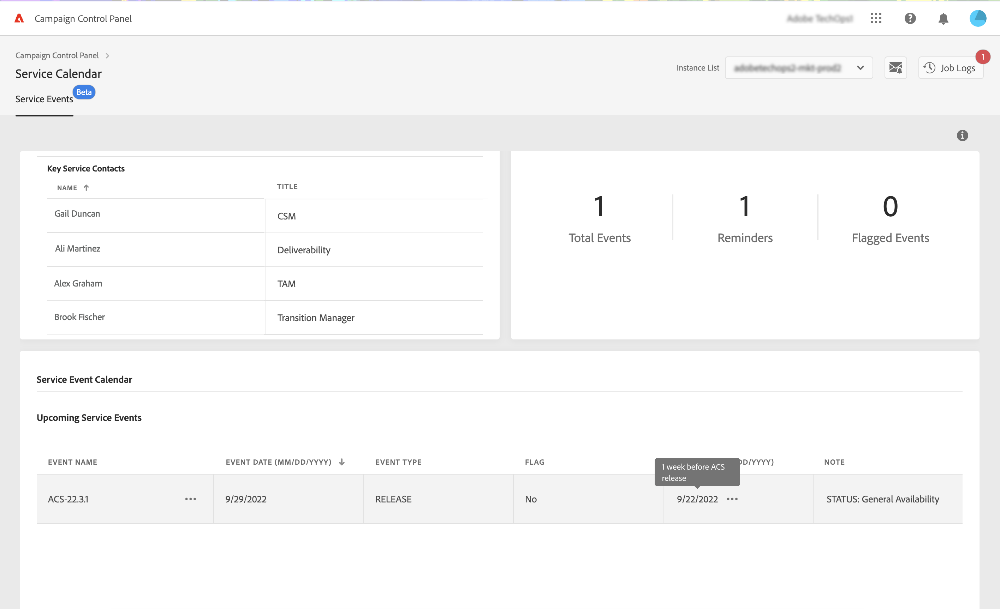

# Monitor key contacts and events {#keycontacts-events}

>[!CONTEXTUALHELP]
>id="cp_servicecalendar_serviceevents"
>title="Service Calendar"
>abstract="The Key contacts section lists the persons at Adobe to contact for any request or issue on your instances. In the Service Event Calendar section, you can identify releases and service reviews for the selected instance and set up reminders for upcoming events."

>[!IMPORTANT]
>
>Service Calendar is available in beta, and subject to frequent updates and modifications without notice.

Identifying events planned on your instances is essential to monitor your Campaign instances.

With Control Panel, you can monitor releases and service reviews occurring on your instances and access a list of key contacts at Adobe for any request or issue.

These information are accessible from the **[!UICONTROL Service Calendar]** card on Control Panel homepage.

## Key contacts {#key-contacts}

The **[!UICONTROL Key contacts]** section lists the persons at Adobe that you can contact for any request or issue on your instances.

>[!NOTE]
>
>This section will show information only for Managed Service Accounts.

Key contacts include the following roles:

* **[!UICONTROL TAM]**: Technical Account Manager,
* **[!UICONTROL CSM]**: Customer Success Manager,
* **[!UICONTROL Deliverability]**: point of contact for deliverability operations,
* **[!UICONTROL Transition Manager]**: Managed Services Transition Manager (Managed Services Account only),
* **[!UICONTROL On-boarding Specialist]**: Specialist assigned to the account to help you on-board onto Campaign Classic (Managed Services Account only).

## Events {#events}

### Monitor events {#monitor-events}

The **[!UICONTROL Service Event Calendar]** section shows all past and upcoming releases and service reviews for the selected instance.

The **[!UICONTROL Note]** column provides information on the status of each release:

* **[!UICONTROL General availability]**: Latest available stable build.
* **[!UICONTROL Limited availability]**: On-demand deployment only.
* **[!UICONTROL Release candidate]**: Engineering validated. Waiting for production proofing.
* **[!UICONTROL Pre release]**: Earlier availability for specific customer needs.
* **[!UICONTROL No longer available]**: The build holds no major issue but a new one is available with additional bug fixes. An upgrade is required.
* **[!UICONTROL Deprecated]**: Build embedding known regressions.
The build is no longer supported. An upgrade is mandatory.

You can assign a flag to one or several upcoming events to keep track of them. To do this, click the ellipsis button next to the event name.

### Set reminders {#reminders}

With Service Calendar, you can set reminders in order to be notified by email before an event is going to occur.

>[!NOTE]
>
>In order to be notified about upcoming events, make sure you have subscribed to email alerts in Control Panel. [Learn more](../performance-monitoring/using/email-alerting.md)

To set an alert for an event, follow these steps:

1. Click the ellipse button next to the event that you want to be reminded of, then select **[!UICONTROL Set Reminder]**.

1. Give a title to the reminder, then select the date at which you want to be notified before the event occurs.

    

    >[!NOTE]
    >
    >If you have not subscribed to Control Panel alerts, a message will display and allow you to enroll to receive email notifications.

1. The reminder is now set for the selected event. You can hover over it at any time to display its title.

    

    >[!NOTE]
    >
    >You can set up to 2 reminders for the same event.

1. On the date specified in the reminder, an email will be sent to notify you about the upcoming event, and the reminder will automatically be removed from the **[!UICONTROL Reminders]** count in the Service Calendar menu.
