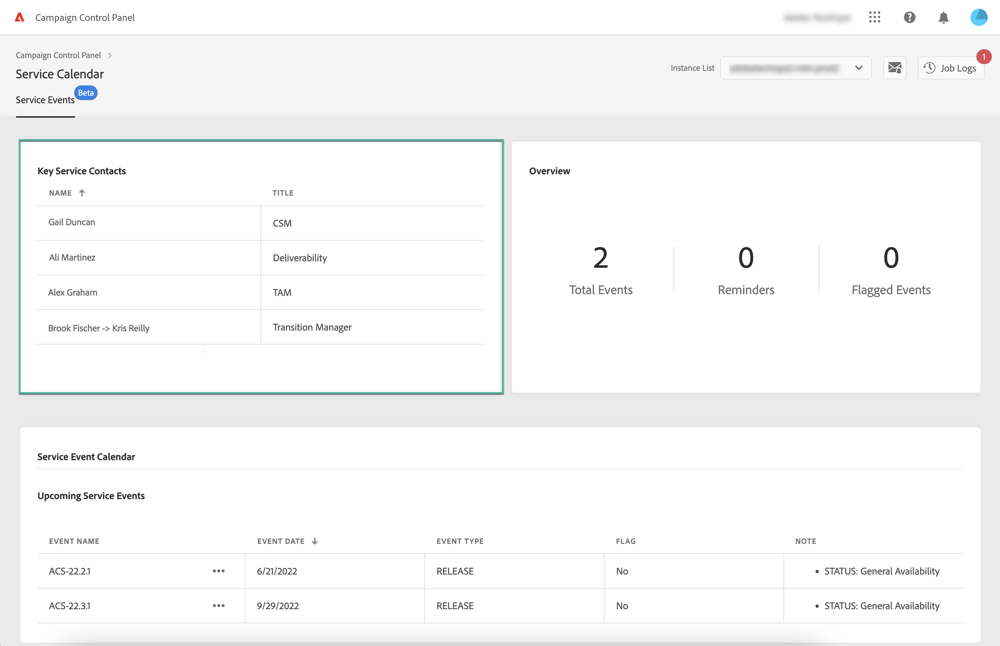
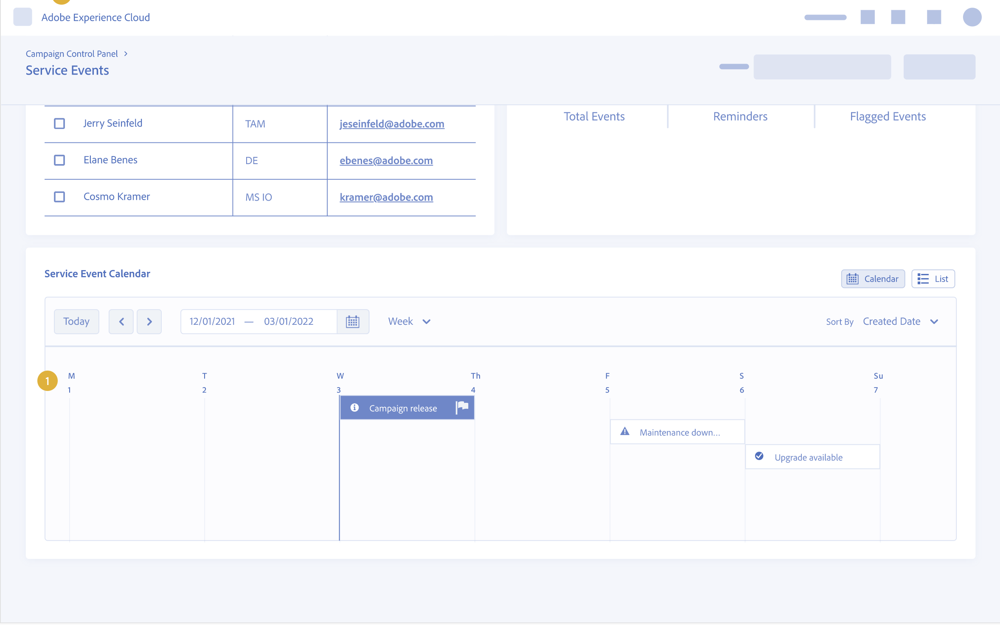
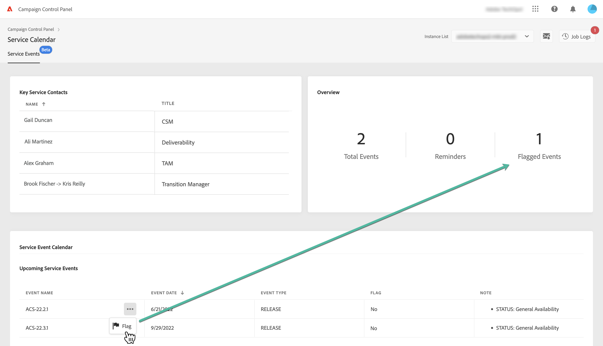

# Identify key contacts and events on your instances {#keycontacts-events}

>[!CONTEXTUALHELP]
>id="xxxx"
>title="xxxx"
>abstract="xxxx"

>[!IMPORTANT]
>
>Service Calendar is available in beta, and subject to frequent updates and modifications without notice.

Identifying events planned on your instances is essential to monitor your Campaign instances.

With Control Panel, you can monitor releases and service reviews occurring on your instances and access a list of key contacts at Adobe for any request or issue.

These information are accessible from the **[!UICONTROL Service Calendar]** card on Control Panel homepage.

## Key contacts {#key-contacts}

The **[!UICONTROL Key contacts]** section lists the persons at Adobe that you can contact for any request or issue on your instances.

>[!NOTE]
>
>This section will show information only for Managed Service Accounts.

Key contacts include the following roles:

* **[!UICONTROL TAM]**: Technical Account Manager,
* **[!UICONTROL CSM]**: Customer Success Manager,
* **[!UICONTROL Deliverability]**: point of contact for deliverability operations,
* **[!UICONTROL Transition Manager]**: Managed Services Transition Manager (Managed Services Account only),
* **[!UICONTROL On-boarding Specialist]**: Specialist assigned to the account to help you on-board onto Campaign Classic (Managed Services Account only).

## Events {#events}

The **[!UICONTROL Service Event Calendar]** section shows all past and upcoming releases and service reviews for the selected instance.

The **[!UICONTROL Note]** column provides information on the status of each release:

* **[!UICONTROL General availability]**: TBC
* **[!UICONTROL Limited availability]**: TBC
* **[!UICONTROL Release candidate]**: TBC
* **[!UICONTROL Pre release]**: TBC
* **[!UICONTROL No longer available]**: TBC
* **[!UICONTROL Deprecated]**: TBC

You can assign a flag to one or several upcoming events to keep track of them. To do this, click the ellipse button next to the event name.

