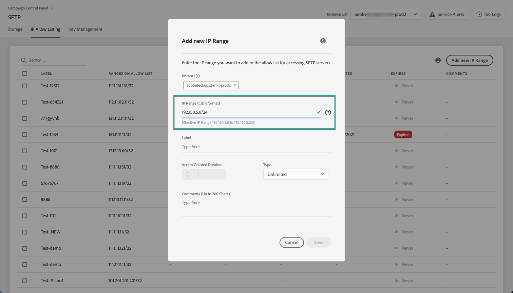
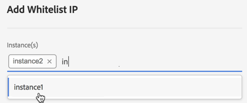
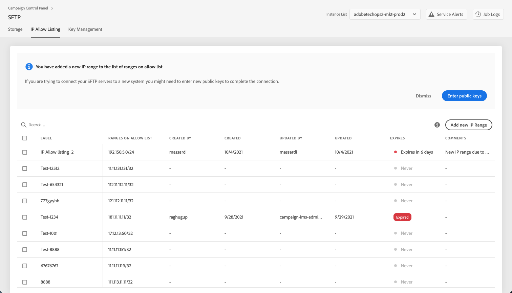
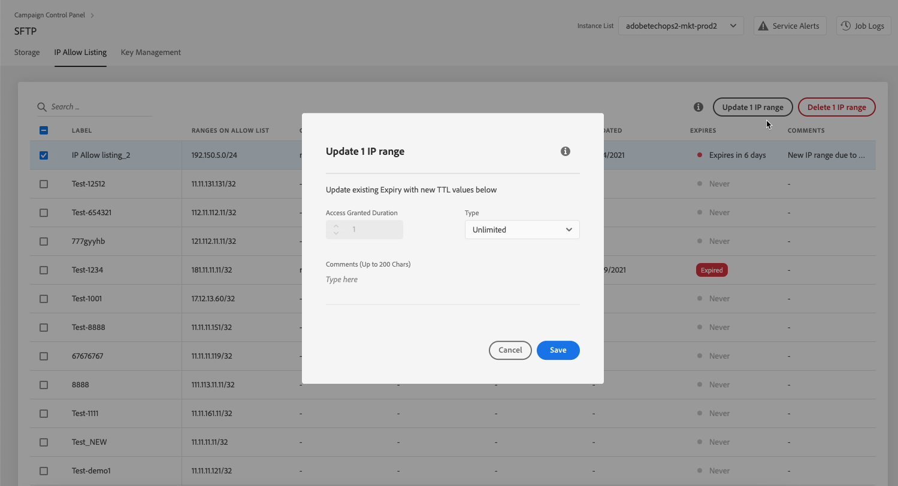
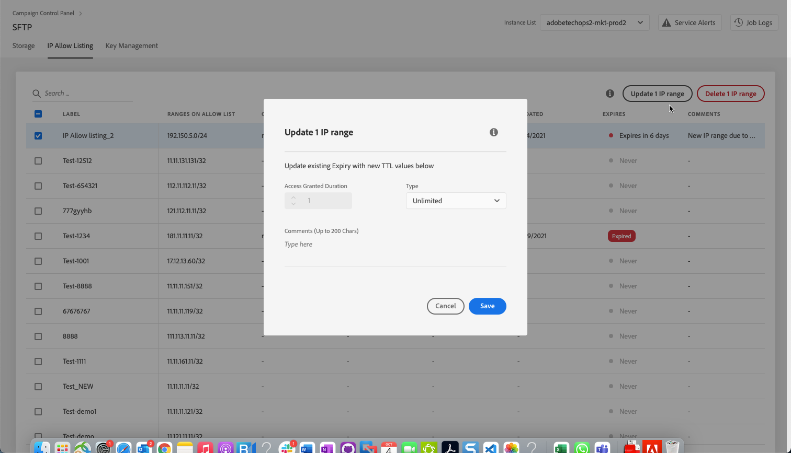

# IP range allow listing {#ip-range-allow-listing}

>[!CONTEXTUALHELP]
>id="cp_ip_whitelist"
>title="About IP allow listing"
>abstract="In this tab, you can add IP ranges to the allow list, in order to establish a connection to your SFTP servers. Only SFTP servers that you have access to are shown here. Please contact your Administrator to request access to other SFTP servers."
>additional-url="https://images-tv.adobe.com/mpcv3/8a977e03-d76c-44d3-853c-95d0b799c870_1560205338.1920x1080at3000_h264.mp4#t=98" text="Watch demo video"

SFTP servers are protected. In order to be able to access them to view files or write new ones, you need to add the public IP address of the system or client that accesses the servers to the allow list.

 Discover this feature in video using [Campaign Classic](https://experienceleague.adobe.com/docs/campaign-classic-learn/control-panel/sftp-management/adding-ip-range-to-allow-list.html?lang=en#sftp-management) or [Campaign Standard](https://experienceleague.adobe.com/docs/campaign-standard-learn/control-panel/sftp-management/adding-ip-range-to-allow-list.html?lang=en#sftp-management)

## About the CIDR format {#about-cidr-format}

CIDR (Classless Inter-Domain Routing) is the supported format when adding IP ranges with the Control Panel interface.

The syntax consists of an IP address, followed by a '/' character, and a decimal number. The format and its syntax are fully detailed in [this article](https://whatismyipaddress.com/cidr){target="_blank"}.

You can search on the internet for free online tools that will help you convert the IP range that you have in hand to CIDR format.

## Best practices {#best-practices}

Make sure you follow the recommendations and limitations below when adding IP addresses to the allow list in the Control Panel.

* **Add IP ranges to the allow list** rather than single IP addresses. To add a single IP address to the allow list, append a '/32' to it to indicate that the range only includes a single IP.
* **Do not add very wide ranges to the allow list**, for example including > 265 IP addresses. The Control Panel will reject any CIDR-format ranges that are between /0 and /23.
* Only **public IP addresses** can be added to the allow list.
* Make sure to **regularly delete IP addresses** that you don't need anymore from the allow list.

## Adding IP addresses to the allow list {#adding-ip-addresses-allow-list}

>[!CONTEXTUALHELP]
>id="cp_sftp_iprange_add"
>title="Add New IP Range"
>abstract="Define the IP ranges that you want to add to the allow list in order to connect to your SFTP servers."

To add an IP range to the allow list, follow these steps:

1. Open the **[!UICONTROL SFTP]** card, then select the **[!UICONTROL IP Allow Listing]** tab.
1. The list of IP addresses on the allow list displays for each instance. Select the desired instance from the left-hand side list, then click the **[!UICONTROL Add new IP range]** button.

    

1. Define the IP Range that you want to add to the allow list, in CIDR format. For example: *192.150.5.0/24*.

    

    >[!IMPORTANT]
    >
    >An IP range cannot overlap an existing range on the allow list. In that case, first delete the range that contains the overlapping IP.
    
1. It is possible to add a range on the allow list for multiple instances. To do this, press the down arrow key or type the first letters of the desired instance, then select it from the suggestions list.

    

1. Define the label that will display in the list.

    

    >[!NOTE]
    >
    >These special characters are allowed in the Label field:
    > `. _ - : / ( ) # , @ [ ] + = & ; { } ! $`

1. To make sure that unused IP ranges are automatically disabled once you do not need them anymore, you can set an expiration date. To do so, select a unit in the **[!UICONTROL Type]** drop-down list and define a duration in the corresponding field.

    

    By default, the **[!UICONTROL Type]** field is set to **[!UICONTROL Unlimited]**, which means that the IP range never expires.

1. If needed, you can type a comment in the corresponding field.

1. Click the **[!UICONTROL Save]** button. IP range addition to the allow list will be displayed as **[!UICONTROL Pending]** until the request is fully processed. This should only take a few seconds.

If you are trying to connect your SFTP servers to a new system, you might need to enter new public keys to complete the connection. When adding new IPs, you need to enter new public keys. For more on this, see [this section](key-management.md).

## IP Allow Listing

The new IP range displays in the **[!UICONTROL IP Allow Listing]** list.

You can sort the items based on the creation date, edition date, by whom it was created or edited, and on the expiry date.

You can also search an IP range by starting to type a label.

The **[!UICONTROL Expires]** column shows how many days remains until the IP range will expire.

You will receive notifications by email 7 days before an IP range will expire? Do you need to subscribe or is it automatic?

An expired IP range will be automatically deleted after 7 days.

## Editing IP ranges

>[!CONTEXTUALHELP]
>id="cp_sftp_iprange_edit"
>title="Edit IP Ranges"
>abstract="Define the IP ranges that you want to add to the allow list in order to connect to your SFTP servers."

To edit IP ranges, select one or more IP ranges from the **[!UICONTROL IP Allow Listing]** list, then click the **[!UICONTROL Update x IP range(s)]** button.

>[!NOTE]
>
>You can only edit the IP range expiry duration and/or add a new comment. To modify the CIDR format, its label or edit the related instance(s), delete the IP range and create a new one corresponding to your needs.

To delete on or more IP ranges from the allow list, select them, then click the **[!UICONTROL Delete IP range]** button.

## Monitoring changes {#monitoring-changes}

The **[!UICONTROL Job Logs]** in the Control Panel home page let you monitor all changes that have been made to IP addresses on the allow list.

For more on the Control Panel interface, refer to [this section](../../discover/using/discovering-the-interface.md).

