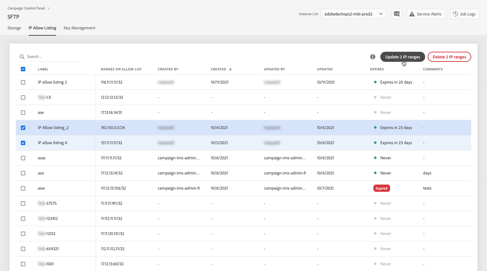
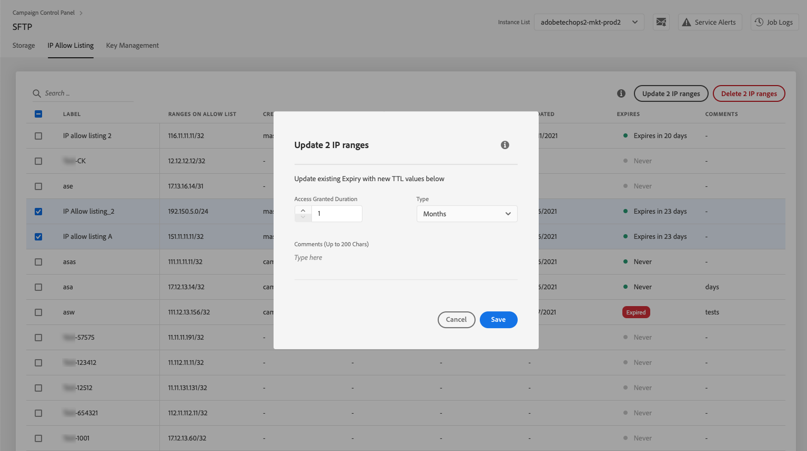

# IP range allow listing {#ip-range-allow-listing}

>[!CONTEXTUALHELP]
>id="cp_ip_whitelist"
>title="About IP allow listing"
>abstract="In this tab, you can add IP ranges to the allow list, in order to establish a connection to your SFTP servers. Only SFTP servers that you have access to are shown here. Please contact your Administrator to request access to other SFTP servers."
>additional-url="https://images-tv.adobe.com/mpcv3/8a977e03-d76c-44d3-853c-95d0b799c870_1560205338.1920x1080at3000_h264.mp4#t=98" text="Watch demo video"

SFTP servers are protected. In order to be able to access them to view files or write new ones, you need to add the public IP address of the system or client that accesses the servers to the allow list.

 Discover this feature in video using [Campaign v7/v8](https://experienceleague.adobe.com/docs/campaign-classic-learn/control-panel/sftp-management/adding-ip-range-to-allow-list.html#sftp-management) or [Campaign Standard](https://experienceleague.adobe.com/docs/campaign-standard-learn/control-panel/sftp-management/adding-ip-range-to-allow-list.html#sftp-management)

## About the CIDR format {#about-cidr-format}

CIDR (Classless Inter-Domain Routing) is the supported format when adding IP ranges with the Control Panel interface.

The syntax consists of an IP address, followed by a '/' character, and a decimal number. The format and its syntax are fully detailed in [this article](https://whatismyipaddress.com/cidr){target="_blank"}.

You can search on the Internet for free online tools that will help you convert the IP range that you have in hand to CIDR format.

## Best practices {#best-practices}

Make sure you follow the recommendations and limitations below when adding IP addresses to the allow list in the Control Panel.

* **Add IP ranges to the allow list** rather than single IP addresses. To add a single IP address to the allow list, append a '/32' to it to indicate that the range only includes a single IP.
* **Do not add very wide ranges to the allow list**, for example including > 265 IP addresses. The Control Panel will reject any CIDR-format ranges that are between /0 and /23.
* Only **public IP addresses** can be added to the allow list.
* Make sure to **regularly delete IP addresses** that you do not need anymore from the allow list.

## Adding IP addresses to the allow list {#adding-ip-addresses-allow-list}

>[!CONTEXTUALHELP]
>id="cp_sftp_iprange_add"
>title="IP range configuration"
>abstract="Define the IP ranges that you want to add to the allow list in order to connect to your SFTP servers."

To add an IP range to the allow list, follow these steps:

1. Open the **[!UICONTROL SFTP]** card, then select the **[!UICONTROL IP Allow Listing]** tab.
1. The list of IP addresses on the allow list displays for each instance. Select the desired instance from the left-hand side list, then click the **[!UICONTROL Add new IP range]** button.

    

1. Define the IP range that you want to add to the allow list. This field only accepts IP ranges in CIDR format, such as *192.150.5.0/24*.

    

    >[!IMPORTANT]
    >
    >An IP range cannot overlap an existing range on the allow list. In that case, first delete the range that contains the overlapping IP.
    
1. It is possible to add a range to the allow list for multiple instances. To do this, press the down arrow key or type the first letters of the desired instance, then select it from the suggestions list.

    

1. Define the label that will display for this IP range in the list.

    

    >[!NOTE]
    >
    >The following special characters are allowed in the **[!UICONTROL Label]** field:
    > `. _ - : / ( ) # , @ [ ] + = & ; { } ! $`

1. To better manage your IP allow list, you can set a duration for the availability of each IP range. To do so, select a unit in the **[!UICONTROL Type]** drop-down list and define a duration in the corresponding field. For more on IP range expiry, see [this section](#expiry).

    

    >[!NOTE]
    >
    >By default, the **[!UICONTROL Type]** field is set to **[!UICONTROL Unlimited]**, which means that the IP range never expires.

1. In the **[!UICONTROL Comment]** field, you can indicate a reason for allowing this IP range (why, for whom, etc.).

1. Click the **[!UICONTROL Save]** button. The IP range addition to the allow list will be displayed as **[!UICONTROL Pending]** until the request is fully processed, which should only take a few seconds.

    

>[!IMPORTANT]
>
>If you are trying to connect your SFTP servers to a new system, and thus adding new IP ranges to the allow list, you might need to enter new public keys to complete the connection. For more on this, see [this section](key-management.md).

## Managing IP ranges {#managing-ip-ranges}

The IP ranges that you create display in the **[!UICONTROL IP Allow Listing]** tab.

You can sort the items based on the creation date or edition date, on the user who created or edited it, and on the IP range expiry.

You can also search an IP range by starting to type a label, a range, a name or a comment.

To edit one or more IP ranges, see [this section](#editing-ip-ranges).

To delete one or more IP ranges from the allow list, select them, then click the **[!UICONTROL Delete IP range]** button.

### Expiry {#expiry}

The **[!UICONTROL Expires]** column shows how many days remain until the IP range will expire.

If you subscribed to [email alerting](../../email-alerting.md), you will receive notifications by email 10 days and 5 days before an IP range will expire, and on the day it is due to expire. Upon receiving the alert, you can [edit the IP range](#editing-ip-ranges) to extend its validity period if needed.

An expired IP range will be automatically deleted after 7 days. It is shown as **[!UICONTROL Expired]** in the **[!UICONTROL Expires]** column. Within this 7 day-period:

* An expired IP range cannot be used anymore to access the SFTP servers.

* You cannot create another IP range that overlaps an expired range. You need to first delete the expired IP range before creating the new one.

* You can [edit](#editing-ip-ranges) an expired IP range and update its duration to make it available again.

* You can delete it from the allow list.

## Editing IP ranges {#editing-ip-ranges}

>[!CONTEXTUALHELP]
>id="cp_sftp_iprange_update"
>title="Update IP ranges"
>abstract="Update the selected IP ranges allowed to connect to your SFTP server."

To edit IP ranges, follow the steps below.

>[!NOTE]
>
>You can only edit IP ranges that have been created since the Control Panel October 2021 release.

<!--Edition is not available for IP ranges that have been created before the Control Panel October 2021 release.-->

1. Select one or more IP ranges from the **[!UICONTROL IP Allow Listing]** list.

1. Click the **[!UICONTROL Update IP range]** button.

    

1. You can only edit the IP range expiry and/or add a new comment.

    >[!NOTE]
    >
    >To modify the CIDR format, its label or edit the related instance(s), you must first delete the IP range and create a new one corresponding to your needs.

    

1. Save your changes.

## Monitoring changes {#monitoring-changes}

The **[!UICONTROL Job Logs]** in the Control Panel home page let you track and monitor all changes that have been made to IP addresses on the allow list.

For more on the Control Panel interface, refer to [this section](../../discover/using/discovering-the-interface.md).

