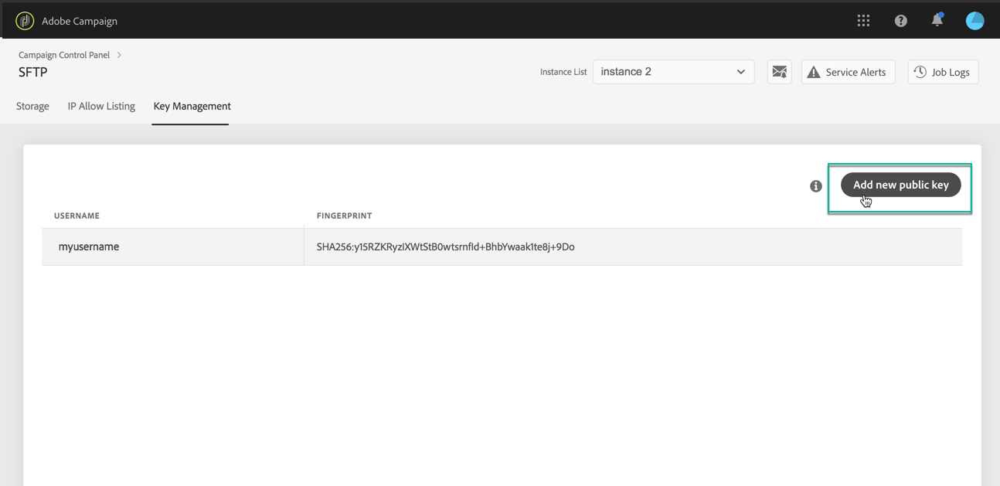

# Key management {#key-management}

>[!CONTEXTUALHELP]
>id="cp_key_management"
>title="About Key Management"
>abstract="In this tab you can manage your public keys."
>additional-url="https://images-tv.adobe.com/mpcv3/8a977e03-d76c-44d3-853c-95d0b799c870_1560205338.1920x1080at3000_h264.mp4#t=166" text="Watch demo video"

Adobe recommends that all customers establish connection to their SFTP servers with a **public and private key pair**.

The steps to generate a public SSH key and add it to access the SFTP server are decribed below, as well as recommendations regarding authentication.

Once access to the server is set up, remember to **add the IP addresses that will require access to the server to the allow list** so that you can connect to it. For more on this, refer to [this section](../../instances-settings/using/ip-allow-listing-instance-access.md).

<!--It is currently not possible to delete a SSH public key.-->

 Discover this feature in video using [Campaign Classic](https://experienceleague.adobe.com/docs/campaign-classic-learn/control-panel/sftp-management/generate-ssh-key.html?lang=en#sftp-management) or [Campaign Standard](https://experienceleague.adobe.com/docs/campaign-standard-learn/control-panel/sftp-management/generate-ssh-key.html?lang=en#sftp-management)

## Best practices {#best-practices}

**About the public SSH key**

Make sure you always use the same authentication to connect to the server, and you are using a supported format for the key.

**API integration with username and password**

In very rare cases password based authentication is enabled on some SFTP servers. Adobe recommends that you use key based authentication, as this method is more efficient and secure. You can request to switch to key based authentication by contacting Customer Care.

>[!IMPORTANT]
>
>If you password expires, even if there are keys installed on your system, you will not be able to login to your SFTP accounts.

## Installing the SSH key {#installing-ssh-key}

>[!CONTEXTUALHELP]
>id="cp_sftp_publickey_add"
>title="Create public key"
>abstract="Define a new public key for an instance to establish connection to your SFTP server."

>[!IMPORTANT]
>
>The steps below are an example of SSH key creation only, please follow your organization guidelines with respect to SSH keys. The example below is just one example of how this can be done and serves as a helpful point of reference for communicating requirements to your team or internal network group.

1. Navigate to the **[!UICONTROL Key Management]** tab, then click the **[!UICONTROL Add new public key]** button.

    

1. In the dialog box that opens, select the username that you want to create the public key for, and the server for which you want to activate the key.

    >[!NOTE]
    >
    >The interface will check if a given username is active on a given instance and give you an option to activate the key on one or several instances.
    >
    >One or more public SSH keys can be added for each user.

    

1. Copy-paste the public SSH key. To generate a public key, follow the steps below corresponding to your operating system:

    >[!NOTE]
    >
    >The public SSH key size should be **2048 bits**.

    **Linux and Mac:**

    Use the Terminal to generate a public and private key pair:
    1. Enter this command: `ssh-keygen -m pem -t rsa -b 2048 -C "your_email@example.com"`.
    1. Provide a name to your key when prompted. If the .ssh directory does not exist, the system will create one for you.
    1. Enter, then re-enter, a passphrase when prompted. It can also be left blank.
    1. A key pair "name" and "name.pub" is created by the system. Search for the "name.pub" file, then open it. It should have alpha-numeric string ending with the email address that you specified.

    **Windows:**

    You might need to install a third party tool that will help you generate private/public key pair in the same format "name.pub".

1. Open the .pub file, then copy-paste the whole string starting with "ssh..." into Control Panel.

    

1. To make sure that unused public keys are automatically disabled once you do not need them anymore, you can set an expiration date. To do so, select a unit in the **[!UICONTROL Type]** drop-down list and define a duration in the corresponding field.

    

    >[!NOTE]
    >
    >By default, the **[!UICONTROL Type]** field is set to **[!UICONTROL Unlimited]**, which means that the IP range never expires.

1. If needed, you can type a comment in the corresponding field.

1. Click the **[!UICONTROL Save]** button to create the key. Control Panel saves the Public key and its associated Fingerprint, encrypted with the SHA256 format.

You can use fingerprints to match the Private keys that are saved on your computer with the corresponding Public keys saved in Control Panel.

The "**...**" button allows you to delete an existing key, or to copy its associated fingerprint into your clipboard.

If the key you created is used to establish a connection with a system that has never been connected to the selected SFTP server before, you will need to add a public IP of that system to the allow list before you are able to use this system with the SFTP server. See [this section](ip-range-allow-listing.md).

## Key Management

The public keys that you create display in the **[!UICONTROL Key Management]** tab.

You can sort the items based on the creation date, edition date, the user who created or edited it, and the expiry date.

You can also search a public key by starting to type a label.

The **[!UICONTROL Expires]** column shows how many days remains until the public key will expire.

If you subscribe to [email alerting](../performance-monitoring/using/email-alerting.md), you will receive notifications by email 10 days and 5 days before a public key will expire, and on the day it is due to expire. Upon receiving the alert, you can [edit the public key](#editing-public-keys) to extend the expiry duration if needed.

An expired public key will be automatically deleted after 7 days.

## Editing public keys {#editing-public-keys}

>[!CONTEXTUALHELP]
>id="cp_sftp_publickey_update"
>title="Edit public keys"
>abstract="Update the selected public keys to access your SFTP server."

To edit public keys, select one or more items from the **[!UICONTROL Key management]** list, then click the **[!UICONTROL Update x public key(s)]** button.

>[!NOTE]
>
>You can only edit the public key expiry duration and/or add a new comment. To modify the , delete the public key and create a new one corresponding to your needs.

To delete on or more public keys from the list, select them, then click the **[!UICONTROL Delete public key]** button.

