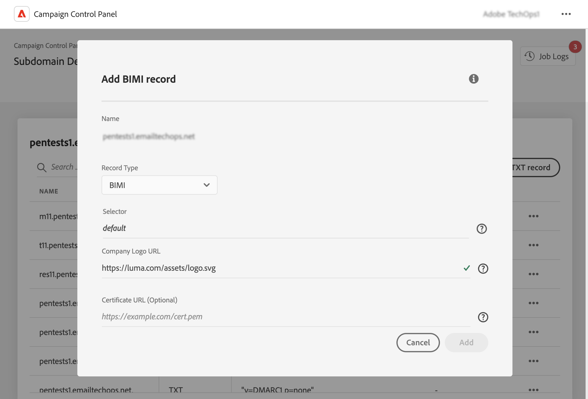

# Add BIMI records {#dmarc}

## About BIMI records {#about}

Brand Indicators for Message Identification (BIMI) is an industry standard that allows an approved logo to appear next to a sender’s email in mailbox providers' inboxes to enhance brand recognition and trust. It helps prevent email spoofing and phishing by verifying the sender's identity through DMARC authentication, making it more difficult for malicious actors to impersonate legitimate brands in emails.

Detailed information on BIMI implementation is available in [Adobe Deliverability Best Practice Guide](https://experienceleague.adobe.com/docs/deliverability-learn/deliverability-best-practice-guide/additional-resources/technotes/implement-bimi.html)

{width="70%" align="center"}

## Limitations & prerequisites {#limitations}

* SPF, DKIM and DMARC records are prerequisites for creating a BIMI record.
* BIMI records can only be added for subdomains using Full subdomain delegation. [Learn more on subdomains configuration methods](subdomains-branding.md#subdomain-delegation-methods)
* DMARC record prerequisites:

    * Record policy type for the subdomain must be set to "Quarantine" or "Reject". BIMI record creation is not available with a DMARC policy type set to "None".
    * The percentage of emails the DMARC policy is applied to must be 100%. BIMI doesn’t support DMARC policies with this percentage set to less than 100%.

        [Learn how to configure DMARC records](dmarc.md)

## Add a BIMI record for a subdomain {#add}

To add a BIMI record for a subdomain, follow these steps:

1. From the subdomains list, click the ellipsis button next to the desired subdomain and select **[!UICONTROL Subdomain details]**.

1. Click the **[!UICONTROL Add TXT record]** button, then choose **[!UICONTROL BIMI]** from the **[!UICONTROL Record type]** drop-down list.

    

1. In the **[!UICONTROL Company Logo URL]**, specify the URL of the SVG file containing your logo.

1. Though **[!UICONTROL Certificate URL]** is optional, it is needed for some mailbox providers like Gmail and Apple which cover 80% of the mailbox market. Hence we recommend getting a Verified Mark Certificate (VMC) to really leverage BIMI. 

    +++How do I get a VMC?

    The main steps to get a VMC are as follows:

    1. Register your brand logo as a trademark with an intellectual property office recognized by VMC issuers. If you have a legal team, we recommend you work with them to get your logo trademarked, or verify it’s already trademarked.

    1. After you verify your logo is trademarked, contact DigiCert or Entrust certificate authority (CA) to request a VMC.

    1. When your VMC is approved, you'll receive an entity certificate Privacy Enhanced Mail (PEM) file. Append any other intermediate certificates you get from the CA to this PEM file. Upload the PEM file (along with appended files) to your public web server, and make note of the PEM file URL. You’ll use the URL in your BIMI TXT record.

    1. Once the BIMI record is visible in the subdomain details page for a particular subdomain, you can use the BIMI Inspector available [here](https://bimigroup.org/bimi-generator/) to check if the BIMI record is functioning correctly.
 
    Detailed information on BIMI implementation is available in the the [BIMI standard documentation](https://bimigroup.org/implementation-guide/)
    +++

1. Click **[!UICONTROL Add]** to confirm the BIMI record creation. 

Once the BIMI record creation has been processed (approximatley 5 minutes), it displays in the subdomains' details screen. [Learn how to monitor TXT records for your subdomains](gs-txt-records.md#monitor)
