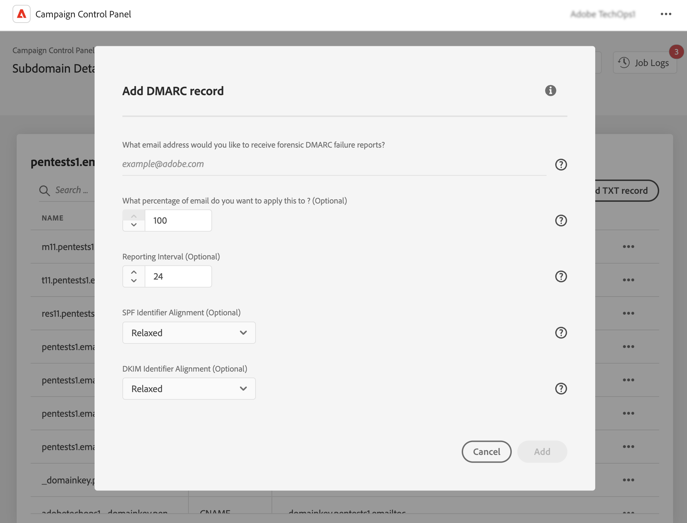

# Add DMARC records {#dmarc}

## About DMARC records {#about}

Domain based Message Authentication, Reporting and Conformance (DMARC) is an email authentication protocol standard that helps organizations protect their email domains from phishing and spoofing attacks. It allows you to decide how a mailbox provider should handle emails that fail SPF and DKIM checks, providing a way to authenticate the sender's domain and prevent unauthorized use of the domain for malicious purposes.

Detailed information on DMARC implementation is available in [Adobe Deliverability Best Practice Guide](https://experienceleague.adobe.com/docs/deliverability-learn/deliverability-best-practice-guide/additional-resources/technotes/implement-dmarc.html)

## Limitations & prerequisites {#limitations}

* SPF and DKIM records are prerequisites for creating a DMARC record.
* DMARC records can only be added for subdomains using Full subdomain delegation. [Learn more on subdomains configuration methods](subdomains-branding.md#subdomain-delegation-methods)
* If both DMARC and BIMI records exist for a subdomain:
    * DMARC records cannot be deleted. If you want to delete a DMARC record, delete the BIMI record first.
    * DMARC records can be edited, but the DMARC policy downgrade to "None" is not allowed and the percentage value must be set to "100".

## Add a DMARC record for a subdomain {#add}

To add a DMARC record for a subdomain, follow these steps:

1. From the subdomains list, click the ellipsis button next to the desired subdomain and select **[!UICONTROL Subdomain details]**.

1. Click the **[!UICONTROL Add TXT record]** button, then choose **[!UICONTROL DMARC]** from the **[!UICONTROL Record Type]** drop-down list.

    

1. Choose the **[!UICONTROL Policy Type]** that the recipient server should follow when one of your emails fails. Available policy types are:

    * **[!UICONTROL None]**,
    * **[!UICONTROL Quarantine]** (spam folder placement),
    * **[!UICONTROL Reject]** (block the email).

    As a best practice, it is recommended to slowly roll out DMARC implementation by escalating your DMARC policy from p=none, to p=quarantine, to p=reject as you gain DMARC understanding of DMARC’s potential impact. 

    * **Step 1:** Analyze the feedback you receive and use (p=none), which tells the receiver to perform no actions against messages that fail authentication, but still send email reports to the sender. Also, review and fix issues with SPF/DKIM if legitimate messages are failing authentication. 

    * **Step 2:** Determine if SPF and DKIM are aligned and passing authentication for all legitimate email, and then move the policy to (p=quarantine), which tells the receiving email server to quarantine email that fails authentication (this generally means placing those messages in the spam folder). If the policy is set to quarantine its recommended that you start with a small percentage of your emails. 

    * **Step 3:** Adjust policy to (p=reject). NOTE: Please use this policy with caution and determine if it is appropriate for your organization. The p= reject policy tells the receiver to completely deny (bounce) any email for the domain that fails authentication. With this policy enabled, only email that is verified as 100% authenticated by your domain will even have a chance at Inbox placement. 

    >[!NOTE]
    >
    > BIMI record creation is not available with a DMARC record policy type set to "None".

1. Fill in the email addresses that should receive the DMARC reports. You can add multiple email addresses, separated by commas. When one of your emails fail, DMARC reports are automatically sent to the email address of your choice:

    * Aggregate-DMARC reports provide high-level information like, for example, the number of emails that failed for a given period.
    * Forensic DMARC failure reports provide detailed information like, for example, which IP address the failed email originate from.

1. If the DMARC policy is set to "None", enter a percentage that applies to 100% of emails. 

    If the policy is set to "Reject" or "Quarantine", it is recommended that you start with a small percentage of your emails. As more emails from your domain pass authentication with receiving servers, update your record slowly with a higher percentage. 

    >[!NOTE]
    >
    >If your domain uses BIMI, your DMARC policy must have a percentage value of 100%. BIMI doesn’t support DMARC policies with this value set to less than 100%.

    

1. DMARC reports are sent every 24 hours. You can change the reports sending frequency in the **[!UICONTROL Reporting Interval]** field. Minimum authorized interval is 1 hour, while maximum authorized value is 2190 hours (i.e. 3 months).

1. In the **SPF** and **[!UICONTROL DKIM Identifier Alignment]** fields, specify how strict the recipient servers should be while checking SPF and DKIM authentications for an email.

    * **[!UICONTROL Relaxed]** mode: the server accepts authentication even if the email is sent from a subdomain,
    * **[!UICONTROL Strict]** mode accepts authentication only when the sender domain matches exactly with a SPF and DKIM domain.

    Let's say we are working with the `http://www.luma.com` domain. In "Relaxed" mode, emails coming from the `marketing.luma.com` subdomain will be authorized by the server, while they will be rejected in "Strict" mode.

1. Click **[!UICONTROL Add]** to confirm the DMARC record creation. 

Once the DMARC record creation has been processed (approximatley 5 minutes), it displays in the subdomains' details screen. [Learn how to monitor TXT records for your subdomains](gs-txt-records.md#monitor)
