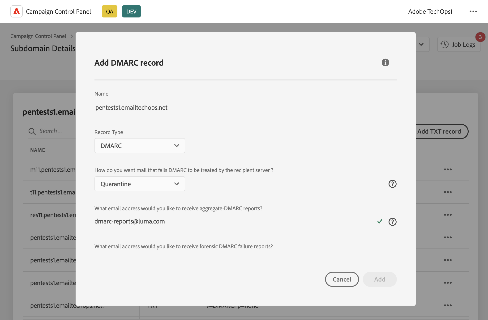

# Add DMARC records {#dmarc}

## About DMARC records {#about}

DMARC (Domain based Message Authentication, Reporting and Conformance) is an email authentication protocol standard that helps organizations protect their email domains from phishing and spoofing attacks.

It allows you to decide how a mailbox provider should handle emails that fail SPF and DKIM checks, providing a way to authenticate the sender's domain and prevent unauthorized use of the domain for malicious purposes.

## Limitations & prerequisites {#limitations}

* SPF and DKIM records are prerequisites for creating a DMARC record.
* DMARC records can only be added for subdomains using Full subdomain delegation. [Learn more on subdomains configuration methods](subdomains-branding.md#subdomain-delegation-methods)
* Each subdomain can have only 1 DMARC record.

## Add a DMARC record for a subdomain (#add)

To add a DMARC record for a subdomain, follow these steps:

1. From the subdomains list, click the ellipsis button next to the desired subdomain and select **[!UICONTROL Subdomain details]**.

1. Click the **[!UICONTROL Add TXT record]** button.

1. In the **[!UICONTROL Record type]** drop-down list, choose **[!UICONTROL DMARC]**.

    

1. Choose the **[!UICONTROL Policy Type]** that the recipient server should follow when one of your emails fails. Available policy types are:

    * None,
    * Quarantine (spam folder placement),
    * Reject (block the email).

    If your subdomain has just been configured, we recommend setting this value to "None" to ensure that your emails are not immediately quarantined or rejected by your recipients' servers. Once your subdomain is fully setup and that your emails are sent correctly, you can change the Policy Type to "Quarantine" or "Reject".

    >[!NOTE]
    >
    > BIMI record creation is not available with a DMARC record policy type set to "None".

1. Fill in the email addresses that should receive the DMARC reports.

    When one of your emails fail, DMARC reports are automatically sent to the email address of your choice:

    * Aggregate-DMARC reports provide high-level information like, for example, the number of emails that failed for a given period.
    * Forensic DMARC failure reports provide detailed information like, for example, which IP address the failed email originate from.

1. By default, all failed emails will be included into the DMARC reports. You can change this parameter to include only a specific percentage of failed email.

1. DMARC reports are sent every 24 hours. You can change the reports sending frequency in the **[!UICONTROL Reporting Interval]** field. Minimum authorized interval is 1 hour, while maximum authorized value is 2190 hours (i.e. 3 months).

1. In the SPF and DKIM Identifier Alignment fields, specify how strict the recipients' servers should be while checking SPF and DKIM authentifcations for an email.

    * **[!UICONTROL Relaxed]** mode: the server accepts authentication even if the email is sent from a subdomain
    * **[!UICONTROL Strict]** mode accepts authentication only when the sender domain amtches exactly with a SPF and DKIM domain

    Let's say we are working we the `http://www.luma.com` domain. In "Relaxed" mode, emails coming from the `marketing.luma.com` subdomain will be authorized by the server, while they will be rejected in "Strict" mode.

1. Click **[!UICONTROL Add]** to confirm the DMARC record creation. 
