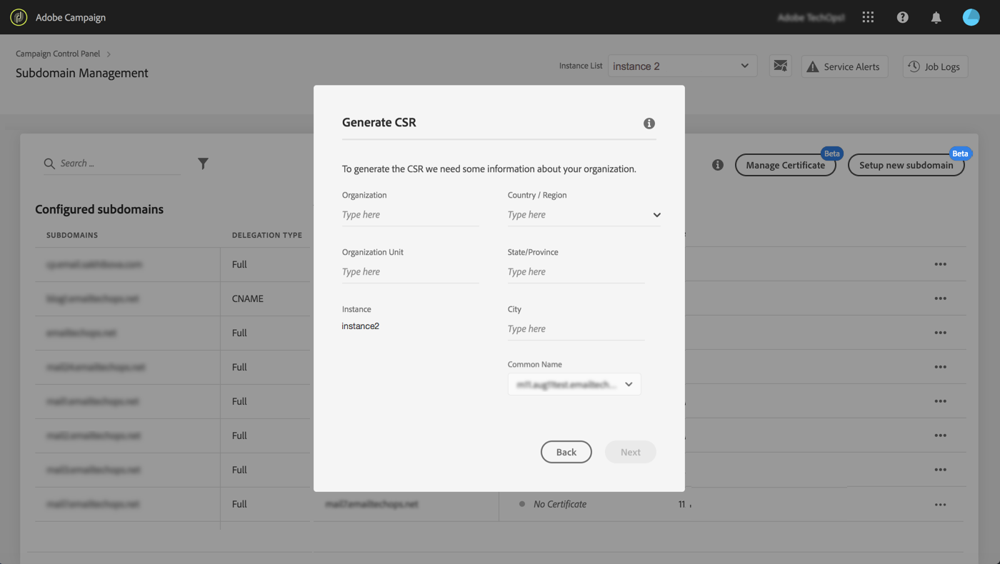

# Generate a CSR {#generating-csr}

>[!CONTEXTUALHELP]
>id="cp_generate_csr"
>title="CSR generation"
>abstract="Certificate Signing Request has to be generated for the instance and subdomains you are planning to secure prior to purchasing a certificate."

>[!CONTEXTUALHELP]
>id="cp_select_subdomains"
>title="Select the subdomains for your CSR"
>abstract="You can choose to include all or only specific subdomains into your Certificate Signing Request. Only selected subdomains will be certified through purchased SSL certificate."
>additional-url="https://experienceleague.adobe.com/docs/control-panel/using/subdomains-and-certificates/subdomains-branding.html" text="About subdomains branding"

## Generate the CSR {#generate}

To generate a Certificate Signing Request (CSR), follow these steps:

1. In the **[!UICONTROL Subdomains & Certificates]** card, select the desired instance, then click the **[!UICONTROL Manage Certificate]** button.

    

1. Select **[!UICONTROL 1 - Generate a CSR]**, then click **[!UICONTROL Next]** to launch the wizard that will guide you through the CSR generation process.

    

1. A form displays, with all the details required to generate your CSR.

    Make sure you fill in the requested information fully and accurately, otherwise the certificate may not be renewed (contact your internal team, Security and IT teams if necessary), then click **[!UICONTROL Next]**.

    * **[!UICONTROL Organization]**: official organization name.
    * **[!UICONTROL Organization Unit]**: unit linked to the subdomain (example: Marketing, IT).
    * **[!UICONTROL Instance]** (pre-filled): URL of the Campaign instance associated to the subdomain.
    * **[!UICONTROL Common name]**: the common name is selected by default, you can select one of the subdomains if necessary.

    

1. Select the subdomains to include into the CSR, then click **[!UICONTROL OK]**.

    

1. The selected subdomains display in the list. For each of them, select the subdomains to include, then click **[!UICONTROL Next]**.

    

1. A summary of the subdomains to include in the CSR displays. Click **[!UICONTROL Submit]** to confirm your request.

    

    >[!NOTE]
    >
    >The **[!UICONTROL Copy CSR content]** button allows you to copy all information related to the CSR (Org ID, instance, organization name, common name, included subdomains etc.)

1. The .csr file corresponding to your selection is automatically generated and downloaded. You can now use it to purchase the SSL certificate from the Certificate Authority that your company approves. If you need to download CSR again, follow the steps detailed in [this section](#download).

Once your CSR has been generated and downloaded, you can use it to purchase an SSL certificate from a Certificate Authority approved by your organization.

After the SSL certificate has been purchased, you will be able to install it on your instance to secure your subdomain. [Learn more](install-ssl-certificate.md)

## Download the CSR {#download}

In order to purchase an SSL certificate, you first need to download the Certificate Signing Request. CSR is automatically downloaded after it has been generated. You can also download it again at any time from the Job Logs:

1. In the **[!UICONTROL Job Logs]**, select the **[!UICONTROL Finished]** tab, then filter the list in order to display jobs related to subdomains management.

    

1. Open the job corresponding to the generation of the CSR, then click the **[!UICONTROL Downbload]** link to get the .csr file.

    
