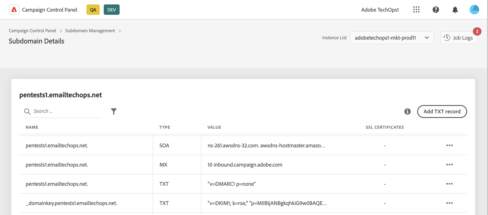

# Get started TXT records {#managing-txt-records}

>[!CONTEXTUALHELP]
>id="cp_siteverification_add"
>title="Managing TXT records"
>abstract="TXT records are a type of DNS records used to provide text information about a domain, that can be read by external sources. Control Panel allows you to add three types of records to your subdomains: Google Site Verification, DMARC, and BIMI records."

## About TXT records {#about}

TXT records are a type of DNS records used to provide text information about a domain, that can be read by external sources. Control Panel allows you to add three types of records to your subdomains:

* **Google TXT records** allow you to attest that you own your domain, ensuring high inbox rates and low spam rates for your emails. [Learn how to add Google TXT records](managing-txt-records.md)
* **DMARC records** provide a way to authenticate the sender's domain and prevent unauthorized use of the domain for malicious purposes. [Learn how to add DMARC records](dmarc.md)
* **BIMI records** allow you to display an approved logo next to your emails in mailbox providers' inboxes to enhance brand recognition and trust. [Learn how to add BIMI records](bimi.md)

## Monitor your subdomains' records {#monitor}

You can monitor all the TXT records that have been added for each subdomain by accessing the subdomains' details.

In this screen, all the TXT-type records for the selected subdomain display, with information in the "Value" column on their configuration. To delete a Google TXT, DMARC or BIMI record, click the ellipsis button then select Delete. You can also edit DMARC and BIMI records if necessary.

