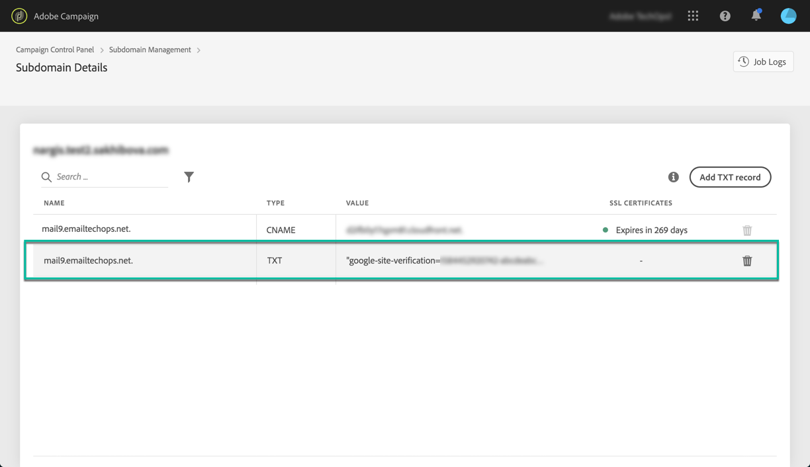

# Add Google Site Verification records {#adding-a-google-txt-record}

In order to ensure high inbox rates, and low spam rates, some services like Google require that you add a TXT record to your domain settings in order to verify that you own the domain.

Currently, Gmail is among one of the most popular email addresses providers. In order to ensure good deliverability and successful delivery of emails to Gmail addresses, Adobe Campaign allows you to add special Google site verification TXT records to your subdomains to ensure that it is verified.

To add a Google TXT record to your subdomain used to email Gmail addresses, follow these steps:

1. From the subdomains list, click the ellipsis button next to the desired subdomain and select **[!UICONTROL Subdomain details]**.

1. Click the **[!UICONTROL Add TXT record]** button, then choose **[!UICONTROL Google Site Verification]** from the **[!UICONTROL Record Type]** drop-down list.

1. Enter the value generated in G Suite Admin tools. For more on this, refer to the [G Suite Admin Help](https://support.google.com/a/answer/183895).

    

1. Click the **[!UICONTROL Add]** button to confirm.

    

Once the TXT record is added, you need to have it verified by Google. To do this, navigate to the G Suite Admin tools then launch the verification step (see [G Suite Admin Help](https://support.google.com/a/answer/183895)).

To delete a record, select it from the records list, then click the remove button.

>[!NOTE]
>
>The only record that you can delete from the DNS records list is the one that you have previously added (in our case the Google TXT record).

 Discover this feature in video using [Campaign v7/v8](https://experienceleague.adobe.com/docs/campaign-classic-learn/control-panel/subdomains-and-certificates/google-txt-record-management.html#subdomains-and-certificates) or [Campaign Standard](https://experienceleague.adobe.com/docs/campaign-standard-learn/control-panel/subdomains-and-certificates/google-txt-record-management.html#subdomains-and-certificates)
