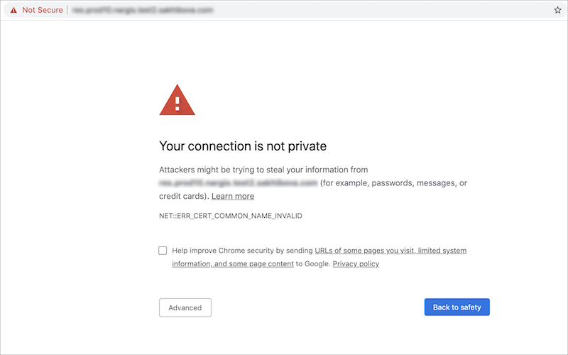
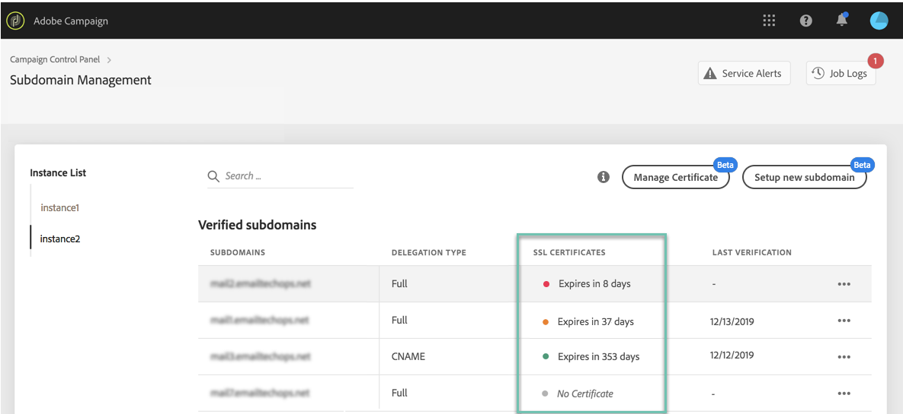
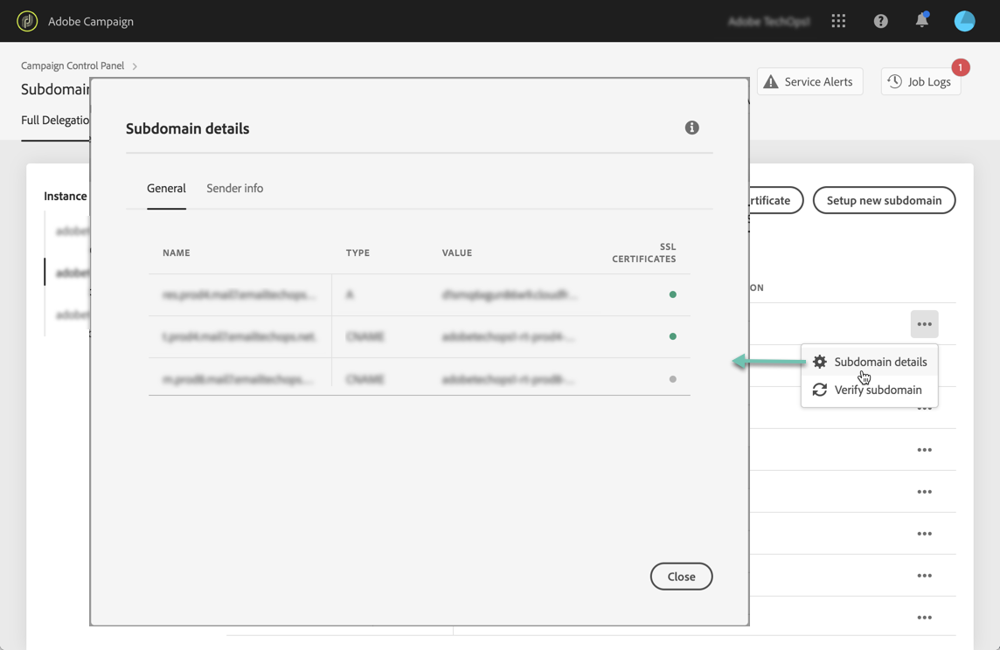

# Monitoring subdomains' SSL certificates {#monitoring-ssl-certificates}

## About SSL certificates {#about-ssl-certificates}

Adobe Campaign recommends that you secure the subdomains that host your landing pages, especially those that are gathering sensitive information of your customers.

**SSL (Secure Socket Layer) encryption** ensures that the subdomains that you configured to work with Adobe are secure. When your customer fills out a web form or visits a landing page hosted by Adobe Campaign, by default the information is sent over non-secure protocol (HTTP). To ensure additional security, secure sent information with a HTTPS protocol. For example, your "http://info.mywebsite.com/" subdomain address will now be "https://info.mywebsite.com/".

**SSL certificates are not installed on the configured subdomains themselves**. They are installed on associated subdomains, mainly those that host landing pages, resource pages and others.

**SSL certificates are provided for a specific period of time** (1 year, 60 days, etc.). Once a certificate expires, you may experience issues when accessing the landing pages or using resources from the subdomain. To prevent this, the Control Panel allows you to monitor your subdomains' SSL certificates, as well as initiate their renewal process. 

## SSL certificates management {#management}

SSL certificates monitoring is key to ensure that your subdomains are secure. With Control Panel, you can install and renew your subdomains' SSL certificates directly by yourself, or delegate them to Adobe so that this process is performed automatically with no action required from your side.

Delegating management of your subdomains' SSL certificates to Adobe is strongly recommended, as Adobe will automatically create the certificate and renew it every year before it expires. This reduce the risk of errors that can occur when managing certificates manually. [Learn how to delegate subdomains' SSL certificates to Adobe](delegate-ssl.md)

Below, you will find a comprehensive list of the impacts associated with manual certificate management as opposed to delegating this operation to Adobe:

|       |Customer-managed certificate|Adobe-managed certificate|
|  ---  |  ---  |  ---  |
|Certificate Provider|3rd party Certificate Authorities|Adobe via AWS Certificate Managers|
|Manual Steps|CSR generation, certificate purchase and installation|None|
|Renewal Process|Customer's responsibility|Managed by Adobe automatically|
|Subdomain Security|Domain can have unsecured subdomains (tracking, mirror, and res) unless you are installing/renewing certificates.|Every new domain (if opted for Adobe managed) will have all subdomains secured by default.|
|Certificate Cost|The customer bears the cost of certificates|Free|

## Monitoring SSL certificates {#monitoring-certificates}

>[!CONTEXTUALHELP]
>id="cp_subdomain_details"
>title="Subdomain details"
>abstract="Retrieve information on your subdomains' SSL certificates."

The status of your subdomains' SSL certificates is available directly from the list of subdomains when selecting the **[!UICONTROL Subdomains & Certificates]** card.

Subdomains are arranged by the closest expiration date of the SSL certificate, with visual information on the expiration, in days:

* **Green**: the subdomain has not certificate expiring within the next 60 days.
* **Orange**: one or more subdomains has a certificate that will expire within the next 60 days.
* **Red**: one or more subdomains has a certificate that will expire within the next 30 days.
* **Grey**: no certificate has been installed for the subdomain.

To get more details on a subdomain, click the **[!UICONTROL Subdomain Details]** button.
The list of all related subdomains displays. It typically includes subdomains of landing pages, resource pages, etc.

The **[!UICONTROL Sender info]** tab provides information on the configured inboxes (Sender, Reply to, Error email).

If one of your subdomain's SSL certificate is about to expire, you can renew it directly from the Control Panel. For more on this, refer to this section: [Renewing a subdomain's SSL certificate](../../subdomains-certificates/using/renewing-subdomain-certificate.md).

**Related topics:**

* [Renewing a subdomain's SSL certificate](../../subdomains-certificates/using/renewing-subdomain-certificate.md)
* [Subdomains branding](../../subdomains-certificates/using/subdomains-branding.md)
