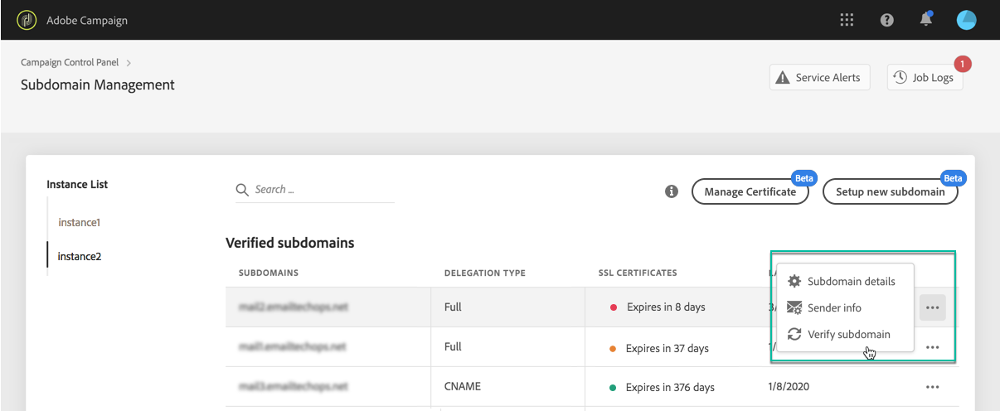

# Monitoring your subdomains {#monitoring-subdomains}

>[!CONTEXTUALHELP]
>id="cp_subdomain_undelegate"
>title="Remove delegated subdomains "
>abstract="This screen allows you to remove any subdomain that has been in delegated in Control Panel. Keep in mind that subdomain removal cannot be undone and will be irreversible once submitted.  If you are trying to remove the primary domain for the selected instance, you will be asked to choose the domain that will replace it."

It is essential to monitor your subdomains to ensure that are all configured properly to work with Adobe Campaign.

The list of subdomains for each of your production instances is accessible directly when selecting the **[!UICONTROL Subdomains & Certificates]** card.

The **[!UICONTROL Last verification]** column indicates when a subdomain was verified for the last time. You can launch a verification at any time by clicking the **...** / **[!UICONTROL Verify subdomain]** button.

>[!IMPORTANT]
>
>Adobe does not recommend using subdomains with no certificate date as it could mean that these subdomains may be having some deliverability issues.

When launching a verification, several operations are performed to check that the subdomain is correctly configured (instance tenant check, email sending test, etc.)

If the subdomain's verification fails, contact Adobe Customer Care for further investigation.

**Related topics:**

* [Renewing a subdomain's SSL certificate](../../subdomains-certificates/using/renewing-subdomain-certificate.md)
* [Subdomains branding](../../subdomains-certificates/using/subdomains-branding.md)
