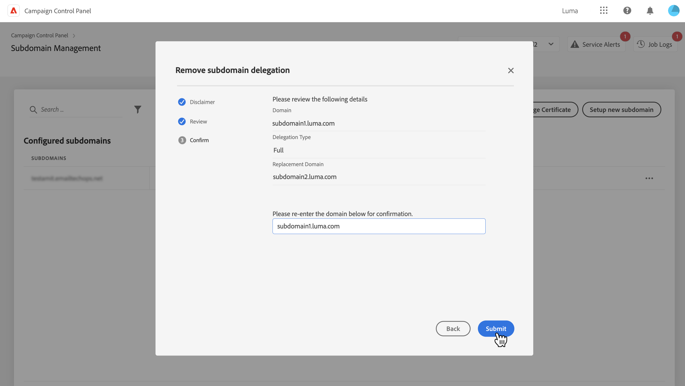

# Remove delegated subdomains {#remove-delegated--subdomains}

>[!CONTEXTUALHELP]
>id="cp_subdomain_undelegate"
>title="Remove delegated subdomains "
>abstract="This screen allows you to remove any subdomain that has been in delegated in Control Panel. Keep in mind that subdomain removal cannot be undone and will be irreversible once submitted.  If you are trying to remove the primary domain for the selected instance, you will be asked to choose the domain that will replace it."

Before removing a delegated subdomain, carefully consider the impacts occuring once the removal process is triggered:

* Subdomain removal cannot be undone and will be irreversible once started,
* No other delegated subdomains can be removed until the current removal process is complete,
* A removed subdomain cannot be re-delegated for the next 2 hours.

To remove a delegated subdomain, follow these steps:

1. Click the ellipsis button next to the domain you want to remove and select **[!UICONTROL Remove delegated subdomain]**.

    

1. Review the disclaimer and acknowledge the domain removal process.

1. Information regarding the instance to which the subdomain is associated displays, including related IP affinities and brand configurations.

    If you are removing the primary domain for the selected instance, you need to choose the domain that will replace it using the **[!UICONTROL Replacement Domain]** list.
    
    Click **[!UICONTROL Next]** to proceed with the removal process.

    

1. Review the summary that displays. To confirm the removal, type the URL of the domain to be removed and click **[!UICONTROL Submit]**.

    
