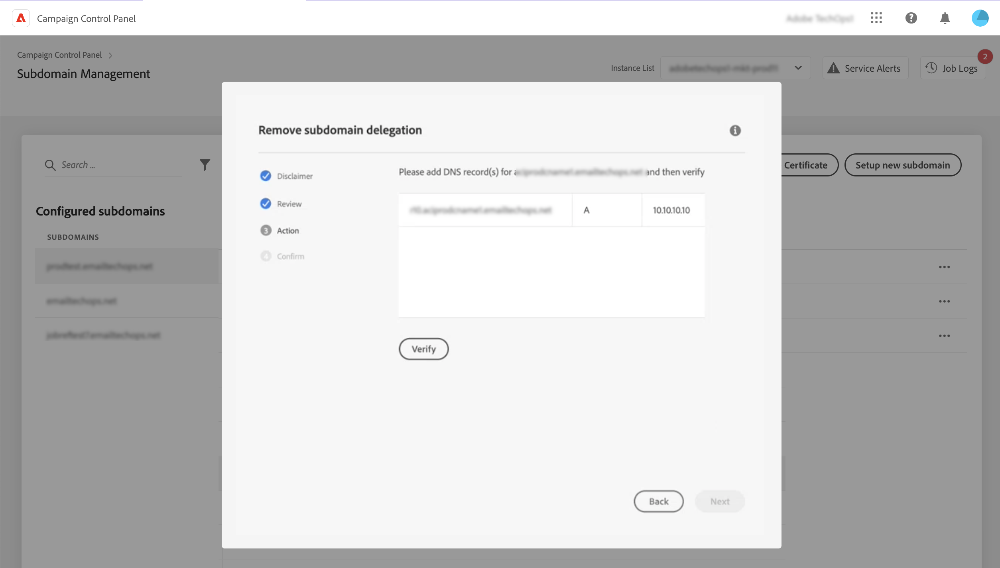

# Remove delegation of subdomains to Adobe {#remove-delegated--subdomains}

>[!CONTEXTUALHELP]
>id="cp_subdomain_undelegate"
>title="Remove subdomain delegation"
>abstract="This screen allows you to remove the delegation of a subdomain to Adobe. Keep in mind that this process cannot be undone and is irreversible until its execution is complete.  If you are trying to remove the delegation of a primary domain for the selected instance, you will be asked to choose the domain that will replace it."

Control Panel allows you to remove the delegation of a subdomain that has been fully delegated to Adobe or delegated using CNAMEs.

## Important notes {#important}

Before proceeding, carefully consider the impacts occuring once the removal process is triggered:

* Once the process is triggered, subdomain delegation removal cannot be undone and is irreversible until the process execution is complete.
* No other subdomain delegation can be removed when a similar process on another subdomain is in progress.
* A delegation removed on a subdomain cannot be re-delegated until 3 days of its removal.

## Remove a subdomain delegation {#steps}

To remove the delegation of a subdomain to Adobe, follow these steps:

1. Click the ellipsis button next to the domain delegation you want to remove and select **[!UICONTROL Remove delegation]**.

    

1. Review the disclaimer and acknowledge the removal of the domain delegation to Adobe.

1. Review information regarding the instance to which the subdomain is associated, including related IP affinities and brand configurations.

    If you are removing the delegation of the primary domain for the selected instance, you need to choose the domain that will replace it using the **[!UICONTROL Replacement Domain]** list.
    
    Click **[!UICONTROL Next]** to proceed with the removal.

    

1. If you removing a CNAME-type delegation or if you are replacing a primary domain with a domain delegated using CNAMEs, an additional **[!UICONTROL Action]** step displays to manage DNS records. [Learn more in this section](#dns)

1. Review the summary that displays. To confirm the removal, type the URL of the domain for which you want to remove the delegation and click **[!UICONTROL Submit]**.

    

After delegation removal has been started, the pending job displays in the job logs until it is completed.

## DNS records management {#dns}

To configure a domain delegation using CNAMEs, Control Panel requires that you add specific records on your DNS server. [Learn how to setup subdomains using CNAMEs](setting-up-new-subdomain.md#use-cnames)

When removing a CNAME-type delegation, you need to **remove these DNS records** from your server to avoid any issue. Additionally, if you want to remove the delegation of a primary subdomain and replace it with a domain that has been delegated using CNAMEs, you may need to **add DNS records** on your server, depending on the IP affinities set for the subdomain.

The table below lists the action(s) to perform depending on the type of delegation you are removing, and the type of delegation used to setup the replacement domain.

|Removed delegation|Replacement domain delegation|Action required|
|  ---  |  ---  |  ---  |
|CNAME|No replacement domain|Delete DNS records|
|CNAME|CNAME|Delete DNS records Add DNS records *(optional depending on the IP affinities)*|
|CNAME|Full|Delete DNS records|
|Full|No replacement domain|No action required|
|Full|CNAME|Add DNS records *(optional depending on the IP affinities)*|
|Full|Full|No action required|

{style="table-layout:auto"}

If one of these actions is required to remove the delegation, an additional **[!DNL Action]** step displays before confirming the delegation removal. This screen lists the DNS records to remove or add, depending on the context.

### Delete DNS records

1. Navigate to your DNS server and remove the records listed in Control Panel.
1. Go back to Control Panel and click **[!UICONTROL Next]** to proceed with the delegation removal.

### Add DNS records

1. Navigate to your DNS server and add the records listed in Control Panel.
1. Wait for the DNS addition to be effective.
1. Go back to Control Panel and click **[!UICONTROL Verify]**.
1. Once the records addition has been successfully verified, click **[!UICONTROL Next]** to proceed with the delegation removal.  

## Error codes {#FAQ}

This section lists the error messages that you may encounter when trying to remove the delegation of a subdomain:

|Error code|Message|Description|
|  ---  |  ---  |  ---  |
|8002|Requested Delegated Domain removal cannot be addressed as there is an similar overlapping request in progress, please try after 3 days|A subdomain delegation removal job is already under process for the selected instance. Wait until 3 days to start a new removal job.|
|8003|Requested Delegated Domain removal is unsupported for this instance.|Delegation removal is not supported for the selected subdomain due to a technical issue, reach out to Customer Care.|
|8004|Requested Delegated Domain removal is not allowed as there is only one domain in this instance.|Only one subdomain has been delegated for the selected instance. Delegation removal is not allowed.|
|8005|Requested Delegated Domain removal is not supported for this configuration.|Delegation removal is not supported for the selected subdomain due to a technical issue, reach out to Customer Care.|
|8006|Requested Delegated Domain removal is not allowed due to unknown reasons. Please contact customer care.|Delegation removal is not supported for the selected instance due to unknown issues, reach out to Customer Care.|
