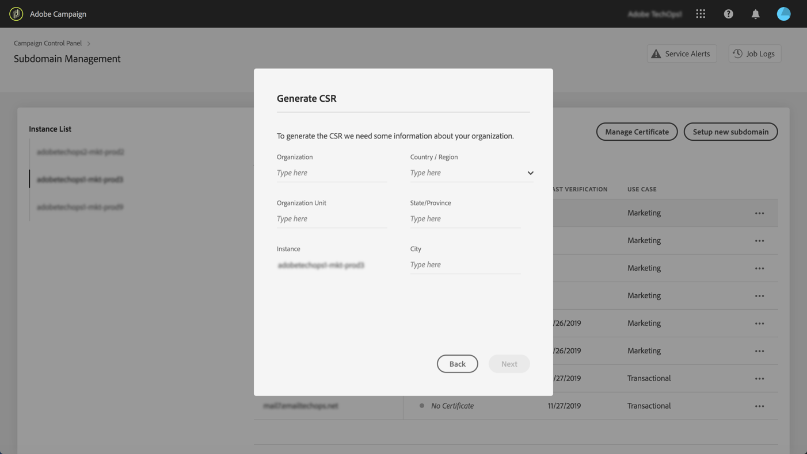
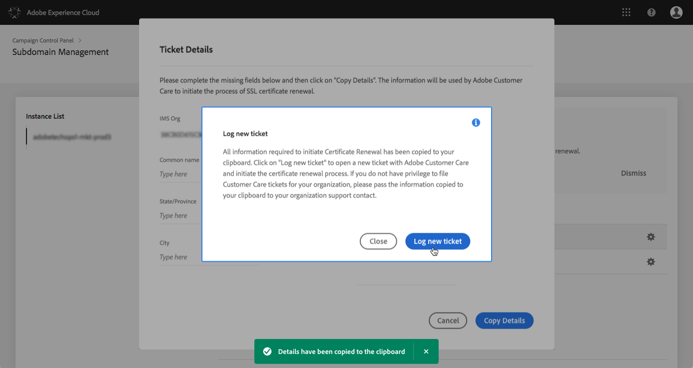
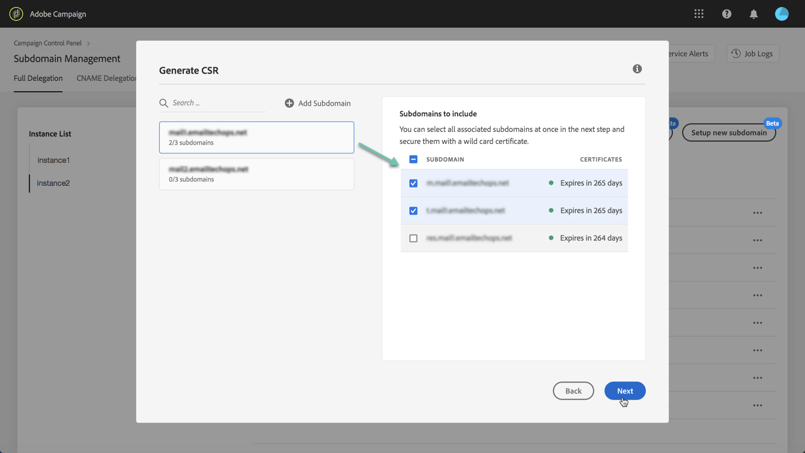
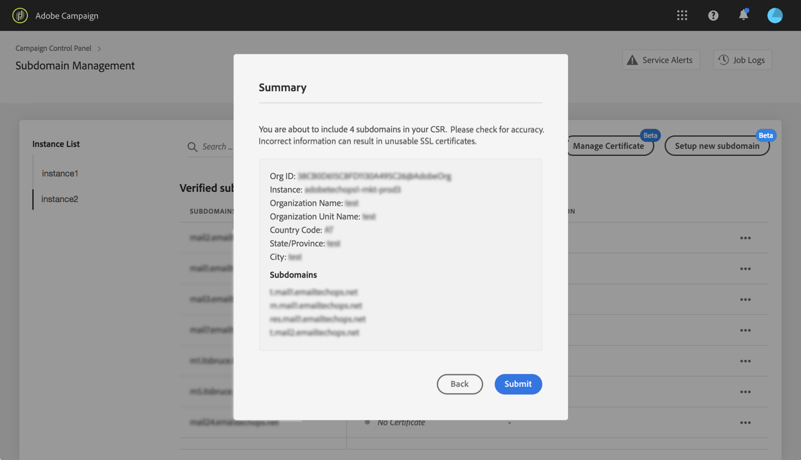
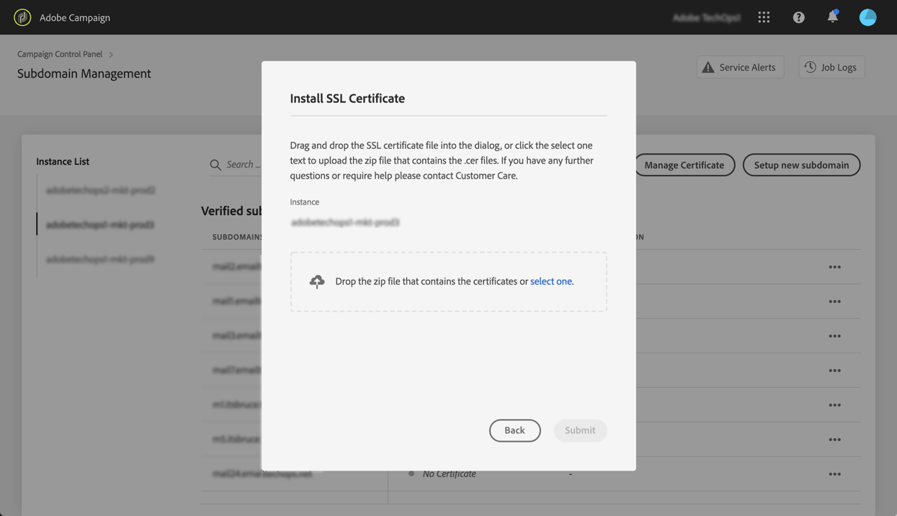

# Renewing a subdomain's SSL certificate {#renewing-subdomains-ssl-certificates}

>[!CONTEXTUALHELP]
>id="cp_add_ssl_certificate"
>title="Add SSL certificate"
>abstract="To add an SSL certificate, you need to generate a CSR, purchase the SSL certificate for your subdomains and install the Certificate Bundle."
>additional-url="https://docs.adobe.com/content/help/en/control-panel/using/subdomains-and-certificates/renewing-subdomain-certificate.html#generating-csr" text="Generating a Certificate Signing Request (CSR)"
>additional-url="https://docs.adobe.com/content/help/en/control-panel/using/subdomains-and-certificates/renewing-subdomain-certificate.html#installing-ssl-certificate" text="How to install a SSL certificate"

## About certificates renewal {#about-certificate-renewal-process}

>[!IMPORTANT]
>
>Subdomain configuration from the Control Panel is available in beta, and subject to frequent updates and modifications without notice.

The SSL certificate renewal process includes 3 steps:

1. **Generation of the Certificate Signing Request (CSR)**
    Adobe Customer Care generates a CSR for you. You will need to provide some information required to generate the CSR (such as Common Name, Organization Name and address, etc.).
1. **Purchase of the SSL certificate**
    Once the CSR is generated, you can download it and use it to purchase the SSL certificate from the Certificate Authority that your company approves.
1. **Installation of the SSL certificate**
    Once you purchase the SSL certificate, you can install it on the desired subdomain.

 Discover this feature in video using [Campaign Classic](https://experienceleague.adobe.com/docs/campaign-classic-learn/control-panel/subdomains-and-certificates/adding-ssl-certificates.html?lang=en#subdomains-and-certificates) or [Campaign Standard](https://experienceleague.adobe.com/docs/campaign-standard-learn/control-panel/subdomains-and-certificates/adding-ssl-certificates.html?lang=en#adding-ssl-certificates)

## Generating a Certificate Signing Request (CSR) {#generating-csr}

>[!CONTEXTUALHELP]
>id="cp_generate_csr"
>title="Generate CSR"
>abstract="Certificate Signing Request has to be generated for the instance and subdomains you are planning to secure prior to purchasing a certificate."

>[!CONTEXTUALHELP]
>id="cp_select_subdomains"
>title="Select the subdomains for your CSR"
>abstract="You can choose to include all or only specific subdomains into your Certificate Signing Request. Only selected subdomains will be certified through purchased SSL certificate."
>additional-url="https://docs.adobe.com/content/help/en/control-panel/using/subdomains-and-certificates/renewing-subdomain-certificate.html#generating-csr" text="Generating a Certificate Signing Request (CSR)"
>additional-url="https://docs.adobe.com/content/help/en/control-panel/using/subdomains-and-certificates/subdomains-branding.html" text="About subdomains branding"

To generate a Certificate Signing Request (CSR), follow these steps:

1. In the **[!UICONTROL Subdomains & Certificates]** card, select the desired instance, then click the **[!UICONTROL Manage Certificate]** button.

    

1. Select **[!UICONTROL 1 - Generate a CSR]**, then click **[!UICONTROL Next]** to launch the wizard that will guide you through the CSR generation process.

    

1. A form displays, with all the details required to generate your CSR.

    Make sure you fill in the requested information fully and accurately, otherwise the certificate may not be renewed (contact your internal team, Security and IT teams if necessary), then click **[!UICONTROL Next]**.

    * **[!UICONTROL Organization]**: official organization name.
    * **[!UICONTROL Organization Unit]**: unit linked to the subdomain (example: Marketing, IT).
    * **[!UICONTROL Instance]** (pre-filled): URL of the Campaign instance associated to the subdomain.

    

1. Select the subdomains to include into the CSR, then click **[!UICONTROL OK]**.

    

1. The selected subdomains display in the list. For each of them, select the subdomains to include, then click **[!UICONTROL Next]**.

    

1. A summary of the subdomains to include in the CSR displays. Click **[!UICONTROL Submit]** to confirm your request.

    

1. The .csr file corresponding to your selection is automatically generated and downloaded. You can now use it to purchase the SSL certificate from the Certificate Authority that your company approves.

    >[!NOTE]
    >
    >If the CSR is not saved/downloaded, it will be lost and you will have to generate it again.

## Purchasing a certificate with the CSR {#purchasing-certificate}

After obtaining a Certificate Signing Request CSR from the Control Panel, purchase an SSL certificate from a Certificate Authority approved by your organization.

## Installing the SSL certificate {#installing-ssl-certificate}

>[!CONTEXTUALHELP]
>id="cp_install_ssl_certificate"
>title="Install SSL Certificate"
>abstract="Install the SSL Certificate that you purchased from the Certificate Authority approved by your organization."
>additional-url="https://docs.adobe.com/content/help/en/control-panel/using/subdomains-and-certificates/subdomains-branding.html" text="About subdomains branding"

Once an SSL certificate has been purchased, you can install it on your instance. Before proceeding, make sure you are aware of the prerequisites below:

* The Certificate Signing Request (CSR) must have been generated from the Control Panel. Otherwise, you will not be able to install the certificate from the Control Panel.
* The certificate Signing Request (CSR) should match the subdomain that has been configured to work with Adobe. For example, it cannot contain more subdomains that the one that has been configured.
* The certificate should have a current date. It is not possible to install certificates with dates in the future, and should not be expired (i.e. valid start and end dates).
* The certificate should be issued by a trusted certificate authority (CA) such as Comodo, DigiCert, GoDaddy, etc.
* The size of the certificate should be 2048 bits and the algorithm should be RSA.
* The certificate should be in X.509 PEM format.
* SAN certificates are supported.
* Wildcard certificates are not supported.
* The ZIP file or the certificate should not be password protected.
* The ZIP file should only contain the following in preferably individual files:
    * End-Entity Certificate.
    * Intermediate Certificate Chain (arranged in proper order).
    * Root certificate (Optional).

To install the certificate, follow these steps:

1. In the **[!UICONTROL Subdomains & Certificates]** card, select the desired instance, then click the **[!UICONTROL Manage Certificate]** button.

    

1. Select **[!UICONTROL 3 - Install Certificate Bundle]**, then click **[!UICONTROL Next]** to launch the wizard that will guide you through the certificate installation process.

    

1. Select the .zip file that contains the certificate to install, then click **[!UICONTROL Submit]**.

    

>[!NOTE]
>
>The certificate will get installed on all domains/subdomains included in the CSR. Any additional domain/subdomain present in the certificate will not be taken into account.

Once the SSL certificate is installed, the certificate's expiration date and status icon are updated accordingly.

**Related topics:**

* [Subdomains branding](../../subdomains-certificates/using/subdomains-branding.md)
* [Monitoring your subdomains](../../subdomains-certificates/using/monitoring-subdomains.md)
