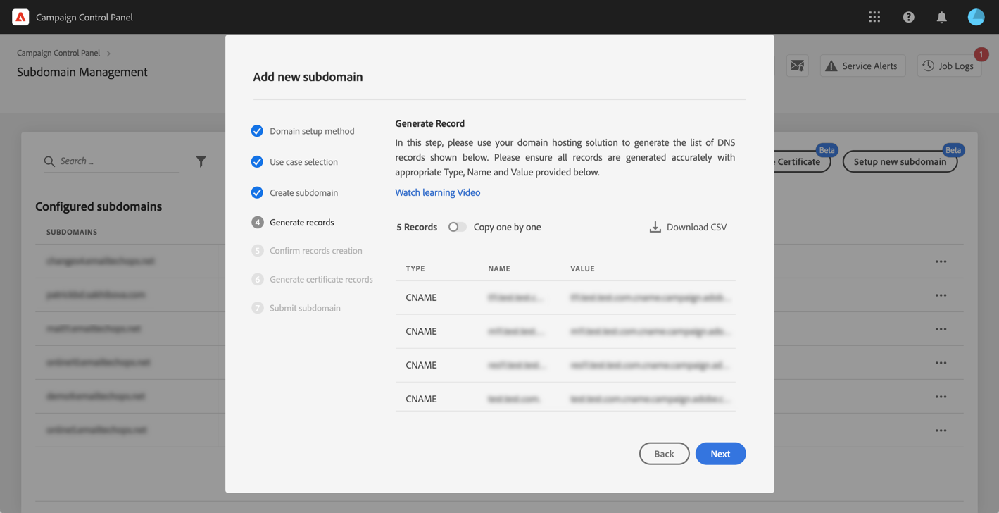
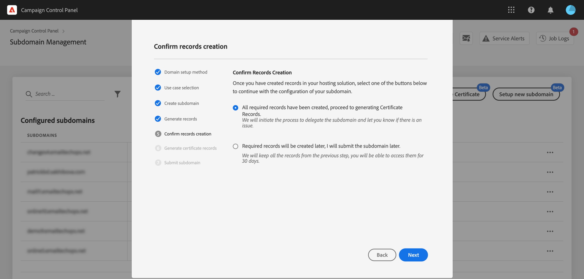

# Setting up a new subdomain {#setting-up-subdomain}

>[!CONTEXTUALHELP]
>id="cp_subdomain_management"
>title="Setup new subdomains and manage certificates"
>abstract="You need to setup a new subdomain and manage your subdomains' SSL certificates to start sending emails or publish landing pages with Adobe Campaign."
>additional-url="https://experienceleague.adobe.com/docs/control-panel/using/subdomains-and-certificates/monitoring-ssl-certificates.html" text="Monitoring SSL certificates"

## Must-read {#must-read}

This page provides information on how to set up new subdomains using Full subdomain delegation or CNAMEs. Global concepts on these two methods are presented in this section: [Subdomains branding](../../subdomains-certificates/using/subdomains-branding.md).

**Related topic:**

* [Monitoring your subdomains](../../subdomains-certificates/using/monitoring-subdomains.md)

### Instance selection

Subdomain configuration is available for **production** instances only.

If the instance that you select in the wizard has no previously setup subdomains, the first configured subdomain will become the **primary subdomain** for that instance and you will not be able to change it in the future. As a result, **reverse DNS records** will be created for other subdomains using this primary subdomain. **Reply-to, and bounce addresses** for other subdomains will be generated from the primary subdomain.

### Delegate subdomains' SSL certificates to Adobe

When setting up a new subdomain, you can have the SSL certificate managed by Adobe. This is strongly recommended, as Adobe will automatically create the certificate and renew it every year before the certificate expires.

If you are using CNAMEs to set up a subdomain delegation, Adobe will provide certificate records to use into your domain hosting solution to generate your certificate.

>[!NOTE]
>
>Adobe managed SSL is a cost-free feature that is available to users at no charge.

### Nameservers configuration

When configuring nameservers, make sure you **never delegate your root subdomain to Adobe**. Otherwise, the domain will be able to work with Adobe only. Any other use will be impossible, like for example sending internal emails to your organization's employees.

Moreover, **do not create a separate zone file** for this new subdomain.

## Full subdomain delegation {#full-subdomain-delegation}

>[!CONTEXTUALHELP]
>id="cp_add_new_subdomain"
>title="Add new subdomain"
>abstract="Adobe recommends full subdomain delegation. However, you can use CNAMEs or custom method to set up your subdomains."
>additional-url="https://experienceleague.adobe.com/docs/control-panel/using/subdomains-and-certificates/setting-up-new-subdomain.html" text="Setting up a new subdomain"
>additional-url="https://helpx.adobe.com/enterprise/using/support-for-experience-cloud.html" text="Contact Customer Care"

>[!CONTEXTUALHELP]
>id="cp_add_subdomain_create_delegate"
>title="Create and delegate your subdomain"
>abstract="Create the subdomain you wish to use with Adobe Campaign in your hosting solution and delegate it to Adobe."
>additional-url="https://experienceleague.adobe.com/docs/control-panel/using/subdomains-and-certificates/setting-up-new-subdomain.html" text="Setting up a new subdomain"

>[!CONTEXTUALHELP]
>id="cp_add_subdomain_submit"
>title="Submit your subdomain"
>abstract="Confirm and submit the subdomain that has been configured in the previous steps."
>additional-url="https://experienceleague.adobe.com/docs/control-panel/using/subdomains-and-certificates/setting-up-new-subdomain.html" text="Setting up a new subdomain"

To fully delegate a subdomain to Adobe Campaign, follow the steps below.

 Discover this feature in video using [Campaign v7/v8](https://experienceleague.adobe.com/docs/campaign-classic-learn/control-panel/subdomains-and-certificates/subdomain-delegation.html#subdomains-and-certificates) or [Campaign Standard](https://experienceleague.adobe.com/docs/campaign-standard-learn/control-panel/subdomains-and-certificates/subdomain-delegation.html#subdomains-and-certificates)

1. In the **[!UICONTROL Subdomains & Certificates]** card, select the desired production instance, then click **[!UICONTROL Setup new subdomain]**.

    

1. Click **[!UICONTROL Next]** to confirm the full delegation method.

    

1. Create the desired subdomain and nameservers in the hosting solution used by your organization. To do this, copy-paste the Adobe Nameserver information displayed in the wizard. For more on how to create a subdomain in a hosting solution, refer to the [tutorial video](https://video.tv.adobe.com/v/30175).
    
    >[!NOTE]
    >
    > For Adobe Campaign Standard, subdomains delegated will allow you to send both **Marketing** and **Transactional** communications.

    

1. Once the subdomain is created with the corresponding Adobe nameserver information, click **[!UICONTROL Next]**.

1. If you selected a Campaign v7/v8 instance, select the desired use case for the subdomain: **Marketing communications** or **Transactional & operational communications**. Global concepts on subdomains' use cases are presented in [this section](../../subdomains-certificates/using/subdomains-branding.md#about-subdomains-use-cases).

    

1. Enter the subdomain that you created into your hosting solution, then click **[!UICONTROL Submit]**.

    Make sure you fill in the **full name** of the subdomain to delegate. For example, to delegate the "usoffers.email.weretail.com" subdomain, type "usoffers.email.weretail.com".

1. To delegate the generation of the subdomain's SSL certificate to Adobe, enable the **[!UICONTROL Opt for Adobe managed SSL for sub-domains]** option. [Learn more on SSL certificates delegation](delegate-ssl.md)

    

Once the subdomain is submitted, various checks and configuration steps  will be performed by the Control Panel. For more on this, see [Subdomain checks and configuration](#subdomain-checks-and-configuration).

## Subdomain configuration using CNAMEs {#use-cnames}

>[!CONTEXTUALHELP]
>id="cp_add_cname_subdomain_create_delegate"
>title="Configure your subdomain"
>abstract="In this screen, specify the subdomain you want to configure using CNAMEs."
>additional-url="https://experienceleague.adobe.com/docs/control-panel/using/subdomains-and-certificates/setting-up-new-subdomain.html" text="Setting up a new subdomain"

>[!CONTEXTUALHELP]
>id="cp_add_cname_records"
>title="Generate records"
>abstract="Navigate to your hosting solution in order to generate the list of DNS records shown in this screen."
>additional-url="https://experienceleague.adobe.com/docs/control-panel/using/subdomains-and-certificates/setting-up-new-subdomain.html" text="Setting up a new subdomain"

>[!CONTEXTUALHELP]
>id="cp_add_cname_subdomain_submit"
>title="Submit your subdomain"
>abstract="Confirm and submit the subdomain that has been configured in the previous steps."
>additional-url="https://experienceleague.adobe.com/docs/control-panel/using/subdomains-and-certificates/setting-up-new-subdomain.html" text="Setting up a new subdomain"

To configure a subdomain using CNAMEs, follow the steps below.

 Discover this feature in video using [Campaign v7/v8](https://experienceleague.adobe.com/docs/campaign-classic-learn/control-panel/subdomains-and-certificates/delegating-subdomains-using-cname.html#subdomains-and-certificates) or [Campaign Standard](https://experienceleague.adobe.com/docs/campaign-standard-learn/control-panel/subdomains-and-certificates/delegating-subdomains-using-cname.html)

1. In the **[!UICONTROL Subdomains & Certificates]** card, select the desired production instance, then click **[!UICONTROL Setup new subdomain]**.

    

1. Select the **[!UICONTROL CNAME]** method, then click **[!UICONTROL Next]**.

    

1. If you selected a Campaign v7/v8 instance, select the desired use case for the subdomain: **Marketing communications** or **Transactional & operational communications**. Global concepts on subdomains' use cases are presented in [this section](../../subdomains-certificates/using/subdomains-branding.md#about-subdomains-use-cases).

    

1. Enter the subdomain that you created into your hosting solution.

    To delegate the generation of the subdomain's SSL certificate to Adobe, enable the **[!UICONTROL Opt for Adobe managed SSL for sub-domains]** option. [Learn more on SSL certificates delegation](delegate-ssl.md)

    

    >[!NOTE]
    >
    >Make sure you fill in the **full name** of the subdomain to setup. For example, to configure the "usoffers.email.weretail.com" subdomain, type "usoffers.email.weretail.com".

1. The list of records to be placed in your DNS servers displays. Copy these records, either one by one, or by downloading a CSV file, then navigate to your domain hosting solution to generate the matching DNS records.

    

1. Make sure that all the DNS records from previous steps have been generated into your domain hosting solution. If everything is configured properly, select the first statement then click **[!UICONTROL Next]** to confirm.

    If you want to create the records and submit the subdomain configuration later on, select the second statement. You will then be able to resume the subdomain configuration directly from the subdomain management screen **[!UICONTROL Processing]** area. Note that DNS records to be placed on your server will be kept by Control Panel 30 days. Beyond that period, you will have to configure the subdomain from scratch.

    >[!NOTE]
    >
    >If you chose not to delegate the SSL certificate to Adobe, this is the last step of the subdomain configuration. Click the **[!UICONTROL Submit]** button. 

    
    
1. If you chose to delegate the subdomains' certificate to Adobe, certificate records are automatically generated. Copy these records, either one by one, or by downloading a CSV file, then navigate to your domain hosting solution to generate the matching certificate. 

    

1. Make sure that all the certificate records have been generated into your domain hosting solution. If everything is configured properly, select the first statement then click **[!UICONTROL Submit]** to confirm.

    

Once the subdomain is submitted, various checks and configuration steps  will be performed by the Control Panel. For more on this, see [Subdomain checks and configuration](#subdomain-checks-and-configuration).

## Subdomain checks and configuration {#subdomain-checks-and-configuration}

1. Once a subdomain has been submitted, the Control Panel will check that it correctly point to Adobe NS records and that the Start of Authority (SOA) record does not exist for this subdomain.

    >[!NOTE]
    >
    >Note that while subdomain configuration runs, other Control Panel requests will be entered into a queue and performed only after the subdomain configuration completes, to prevent any performance issues.

1. If the checks are successful, the Control Panel will start setting up the subdomain with DNS records, additional URLs, inboxes etc.

    

    You can get more details on the configuration progress by clicking the subdomain configuration **[!UICONTROL Details]** button.

    

1. Eventually, the **Deliverability team** will be notified about the new subdomain, in order to audit it. The audit process can take up to 10 business days after the subdomain has been configured.

    >[!IMPORTANT]
    >
    >The deliverability checks that are performed include feedback loops and spam complaint loops testing. We therefore do not recommend using the subdomain before the audit has been completed, as it could result in bad subdomain reputation.
    >
    >However, note that you can perform operations related to SSL certificates on your subdomain, even if the deliverability audit is still processing.

1. At the end of the process, the subdomains will be configured to work with your Adobe Campaign instance and the elements below will be created:

    * **The subdomain with the following DNS records**: SOA, MX, CNAME(s), DKIM, SPF, TXT,
    * **Additional subdomains** to host mirror, resource, tracking pages and domain key,
    * **Inboxes**: Sender, Error, Reply-to.

    By default, the "Reply-to" inbox from the Control Panel is configured to clear emails and is not reviewable. If you want to monitor your "Reply-to" inbox for your marketing campaigns, do not use this address.

You can get more details on the subdomain by clicking the **[!UICONTROL Subdomain details]** and **[!UICONTROL Sender info]** buttons.

## Troubleshooting {#troubleshooting}

* In some cases, subdomain configuration goes through, but the subdomain may not be successfully verified. The subdomain will stay into the **[!UICONTROL Configured]** list with a job log providing information on the error. Contact Customer Care if you have trouble resolving the issue.
* If the subdomain is being shown as “Unverified” after being configured, launch a new subdomain verification (**...** / **[!UICONTROL Verify subdomain]**). If it still shows the same status, the reason could be that there is some customisation done on recipients schema, which cannot be verified using standard processes. Please try sending out a campaign with that subdomain.
* If the subdomain configuration is taking too long (more than 10 business days) at deliverability audit step, please reach out to Customer Care.
